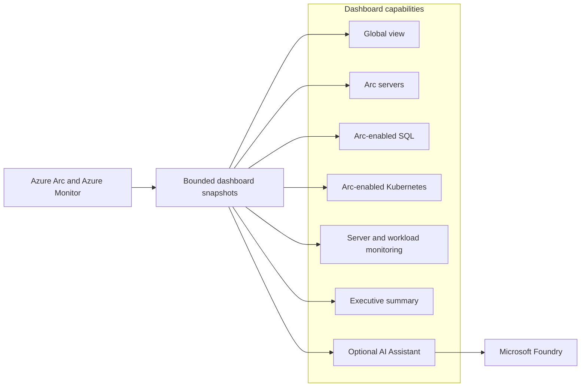
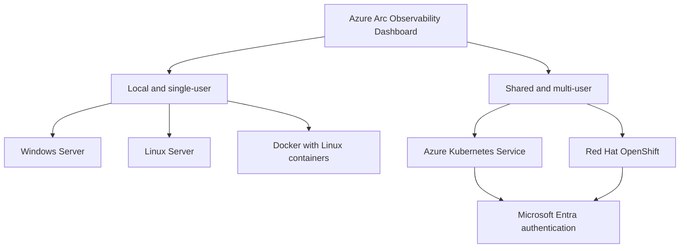
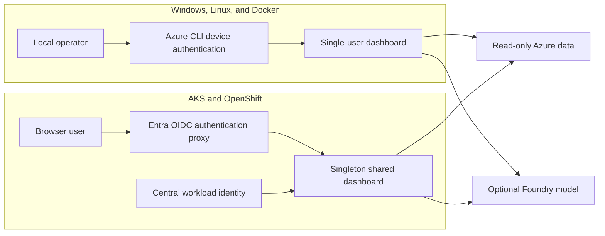

# Azure Arc Observability Dashboard

The Azure Arc Observability Dashboard is a read-only operations experience for Azure
Arc-enabled infrastructure. It combines server, SQL, Kubernetes, monitoring, lifecycle,
deployment, geography, assessment, and optional Microsoft Foundry insights in one
self-contained dashboard.

The dashboard supports local single-user installations and authenticated shared deployments.

## Capabilities

| Capability | Highlights |
|---|---|
| Global operations view | Combined server and Kubernetes estate totals, health indicators, alerts, updates, and geographic views |
| Arc server inventory | Searchable and sortable server inventory with platform, operating system, connectivity, lifecycle, extension, and health details |
| Arc-enabled Kubernetes | Connected-cluster health, versions, distributions, infrastructure types, extensions, node/core totals, certificate risk, and connectivity status |
| Arc-enabled SQL | SQL instance inventory, versions, editions, licensing, databases, patching, Defender status, and migration posture |
| Agent deployment status | Azure Monitor Agent, Dependency Agent, extension coverage, and a reviewable Cloud Shell deployment-script generator |
| Server monitoring | Time-bounded CPU, memory, disk, network, heartbeat, alerts, updates, events, and Syslog observations for one selected server |
| Workload monitoring | Comparative monitoring for 1–10 servers with workload totals, utilization, change indicators, risk, and rolling observations |
| VM SKU assessment | Read-only regional Azure VM sizing suggestions based on observed CPU, memory, and configurable headroom |
| Lifecycle insights | Windows Server and Linux lifecycle posture, ESU indicators, support bands, and prioritized attention areas |
| Security posture | Defender indicators, security and critical updates, extension coverage, and reboot requirements |
| Executive reporting | Printable Arc Summary with directional readiness, estate composition, risks, and recommended actions |
| AI Assistant | Optional Microsoft Foundry chat grounded in bounded, read-only dashboard tools and the configured Arc scope |

## Dashboard experience

## Deployment options

| Deployment | Intended use | User model | Package |
|---|---|---|---|
| Windows Server | Local dashboard on a Windows workstation or server | Single user | [Windows Server](deploy/serverinstall/WindowsServer/README.md) |
| Linux Server | Local dashboard on Ubuntu, Debian, Fedora, or RHEL-family Linux | Single user | [Linux Server](deploy/serverinstall/LinuxServer/README.md) |
| Local Docker | Portable local container deployment | Single user | [Docker](deploy/docker/README.md) |
| Azure Kubernetes Service | Shared dashboard hosted on AKS | Multiple authenticated users | [AKS](deploy/kubernetes/AKS/README.md) |
| Red Hat OpenShift | Shared dashboard hosted on OpenShift | Multiple authenticated users | [OpenShift](deploy/kubernetes/OpenShift/README.md) |

All deployment models use the same dashboard capabilities. Platform packages provide the
appropriate launcher, identity, storage, authentication, and network configuration.

> [!IMPORTANT]
> Run one dashboard instance for each configured Azure scope. The Docker, AKS, and OpenShift
> packages intentionally use singleton execution to avoid duplicate Azure Resource Graph and
> Log Analytics queries.

## Supported operating systems and platforms

| Platform | Supported versions or families |
|---|---|
| Windows | Windows 10/11 and supported Windows Server releases with PowerShell 7 |
| Ubuntu/Debian | Supported 64-bit releases capable of running PowerShell 7.4 or later and Azure CLI |
| Fedora/RHEL | Supported 64-bit Fedora and Red Hat Enterprise Linux family releases capable of running PowerShell 7.4 or later and Azure CLI |
| Docker | Docker Engine or Docker Desktop running Linux containers |
| AKS | Azure Kubernetes Service with OIDC issuer and Workload Identity |
| OpenShift | Red Hat OpenShift 4.14 or later with the `restricted-v2` security context constraint |

The Linux Server package is shared across Ubuntu/Debian and Fedora/RHEL families. Only
prerequisite installation commands differ between APT- and DNF-based systems.

## Prerequisites

### Common Azure prerequisites

- An Azure subscription containing Azure Arc-enabled servers, Arc-enabled SQL resources,
  Arc-enabled Kubernetes clusters, or a combination of these resources.
- Microsoft Entra access to the target tenant.
- **Reader** access to the selected subscription or resource groups.
- **Log Analytics Reader** access when Log Analytics telemetry is required.
- **Monitoring Reader** access for Azure Monitor metrics, alerts, and related monitoring data.
- Network access to Microsoft Entra ID, Azure Resource Manager, Azure Resource Graph,
  Azure Monitor, and Log Analytics.
- A modern browser.

### Monitoring prerequisites

- Azure Monitor Agent installed on monitored servers.
- Data Collection Rules sending the required performance counters, Windows Event data, or
  Syslog data to an accessible Log Analytics workspace.
- Heartbeat, performance, event, update, and alert data available for the selected resources.

Missing telemetry is shown as unavailable rather than estimated.

### Microsoft Foundry prerequisites

The AI Assistant is optional. When enabled, it requires:

- A Microsoft Foundry or Azure OpenAI resource.
- A compatible deployed chat-completions model.
- An endpoint ending in `.services.ai.azure.com` or `.openai.azure.com`.
- **Cognitive Services OpenAI User** access for each identity using the model.
- Outbound HTTPS access to the configured model endpoint.

No Foundry API key is stored by the dashboard.

### Deployment-specific prerequisites

| Deployment | Additional prerequisites |
|---|---|
| Windows Server | PowerShell 7, Azure CLI, and a local browser or approved remote desktop session |
| Linux Server | PowerShell 7.4+, Azure CLI, Bash, and a filesystem that enforces Unix ownership and permissions |
| Docker | Docker Engine 24+ or Docker Desktop, Docker Compose v2, and Linux-container support |
| AKS | Helm 3, ingress and TLS, persistent storage, AKS Workload Identity, and an Entra application for `oauth2-proxy` |
| OpenShift | Helm 3, `oc`, TLS Route and DNS, persistent storage, federated Azure identity, and an Entra application for `oauth2-proxy` |

## Authentication and security

- The dashboard is designed for read-only Azure operations.
- Local packages bind to the host loopback interface.
- Shared Kubernetes packages expose only the Entra authentication proxy.
- Configuration and monitoring state are encrypted at rest.
- AKS and OpenShift keep shared Arc inventory separate from per-user monitoring and Foundry
  sessions.
- Shared configuration changes are restricted to designated dashboard administrators.

## Documentation

### Server installations

- [Server deployment overview](deploy/serverinstall/README.md)
- [Windows Server configuration guide](deploy/serverinstall/WindowsServer/deploymentguide/dashboard-configuration-guide.md)
- [Linux Server configuration guide](deploy/serverinstall/LinuxServer/deploymentguide/dashboard-configuration-guide.md)

### Container and Kubernetes installations

- [Local Docker deployment](deploy/docker/README.md)
- [AKS deployment](deploy/kubernetes/AKS/README.md)
- [OpenShift deployment](deploy/kubernetes/OpenShift/README.md)

Each package includes detailed configuration, authentication, security, operations,
troubleshooting, upgrade, backup, and removal guidance.
