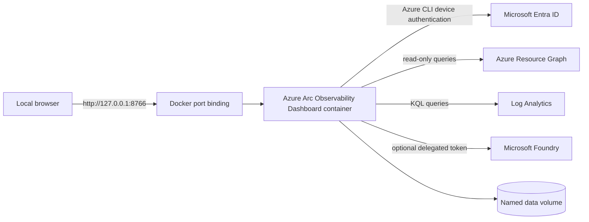

# Azure Arc Observability Dashboard - local Docker deployment

This package runs the Azure Arc Observability Dashboard as one local, single-user container. It uses
the same dashboard pages, Azure Resource Graph queries, Log Analytics queries, monitoring
baselines, and Microsoft Foundry integration as the Linux Server package.

> [!IMPORTANT]
> Run exactly one container for a dashboard scope. The application performs centralized
> background inventory refreshes; scaling it creates duplicate Azure queries and conflicting
> local monitoring state.

## Architecture



The container listens on port `8766` internally, but Compose publishes it only on host
loopback. The application filesystem is read-only. Configuration, Azure CLI profiles,
encryption material, and monitoring baselines are stored in the `arc-dashboard-data` volume.

## Prerequisites

- Docker Engine 24 or later, or Docker Desktop with Linux containers
- Docker Compose v2 (`docker compose`)
- Browser access to `https://microsoft.com/devicelogin`
- Network access from the container to Microsoft Entra ID, Azure management APIs, Azure
  Resource Graph, Log Analytics, and the configured Foundry endpoint
- Azure permissions documented in
  [the configuration guide](deploymentguide/dashboard-configuration-guide.md)

## Build and start

Run these commands from this directory:

```powershell
docker compose build
docker compose up -d
docker compose logs -f arc-dashboard
```

Open <http://127.0.0.1:8766>. Complete the displayed Azure device-code sign-in, select the
subscription and Arc resource groups, then save the configuration.

The first inventory collection can take several minutes for a large environment. The live
probe becomes available immediately; readiness returns HTTP 503 until dashboard scope is
configured.

## Persistent state

| Path in volume | Purpose |
|---|---|
| `.azure/` | Azure CLI profile for shared Arc inventory |
| `.azure-foundry/` | Isolated optional Foundry Azure CLI profile |
| `.secrets/master.key` | AES-256-GCM local encryption key |
| `dashboard.config.dat` | Encrypted dashboard scope |
| `.monitoring/` | Encrypted server and workload baselines |
| `.runtime/` | Short-lived device-login output |

Do not copy the named volume to another host without protecting it as sensitive operational
data. The key and encrypted data must remain together for restoration.

## Common operations

```powershell
# Status
docker compose ps

# Follow logs
docker compose logs -f --tail 200 arc-dashboard

# Stop without deleting state
docker compose down

# Rebuild after updating package files
docker compose build --pull
docker compose up -d

# Remove the deployment and all saved state
docker compose down --volumes
```

Do not use `docker compose up --scale arc-dashboard=2`.

## Security defaults

- Host port is bound to `127.0.0.1`, not all interfaces.
- The container runs as UID `10001`, drops all Linux capabilities, denies privilege
  escalation, and uses a read-only root filesystem.
- Only `/var/lib/arc-dashboard` and `/tmp` are writable.
- Dashboard configuration and monitoring state are encrypted with AES-256-GCM.
- No Foundry API key is stored; the optional AI assistant uses a delegated Entra token.
- The browser cookie reduces cross-origin request risk but is not multi-user authentication.

Do not expose this local package through a reverse proxy or shared network. Use the
authenticated AKS or OpenShift package for shared access.

## Guides

- [Configuration and operations](deploymentguide/dashboard-configuration-guide.md)
- [Foundry authentication](deploymentguide/foundry-authentication-guide.md)
