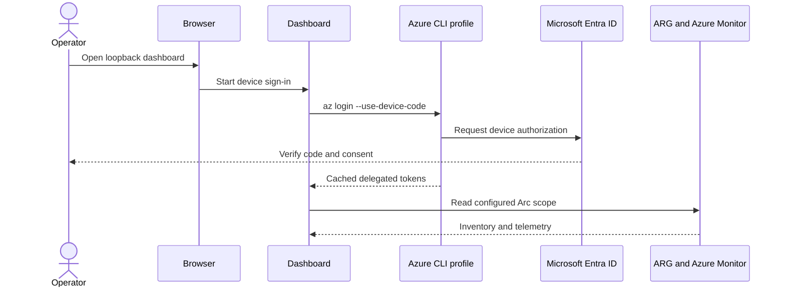

# Local Docker configuration and operations guide

## 1. Purpose

This guide covers deployment, Azure authorization, configuration, persistence, health,
upgrades, backup, recovery, and troubleshooting for the single-user Docker package.

## 2. Identity and data flow



The signed-in identity should have only the read permissions required for the configured
scope. The dashboard does not need Owner or Contributor.

## 3. Azure permissions

Assign permissions at the narrowest practical subscription or resource-group scope:

| Function | Typical Azure role |
|---|---|
| Arc inventory and resource metadata | Reader |
| Log Analytics queries | Log Analytics Reader |
| Azure Monitor metrics and alerts | Monitoring Reader |
| Foundry chat, when enabled | Cognitive Services OpenAI User on the Foundry resource |

Custom roles can be used if they permit the relevant read actions. Resource Graph results
are limited by the signed-in user's Azure RBAC assignments.

## 4. Deployment

1. Copy this complete directory to the Docker host.
2. Review `compose.yaml`; keep the host-side port bound to `127.0.0.1`.
3. Run `docker compose build`.
4. Run `docker compose up -d`.
5. Open `http://127.0.0.1:8766`.
6. Complete device authentication and save the dashboard scope.

The Dockerfile downloads Azure CLI from Microsoft's package repository during build. For
repeatable production builds, supply an approved Azure CLI version through
`--build-arg AZURE_CLI_VERSION=<version>`.

## 5. Scope configuration

Choose one subscription and one or more resource groups containing Arc-enabled resources.
The dashboard builds a single immutable shared snapshot on a bounded interval. Resource Graph
pagination and Log Analytics concurrency remain bounded even for large scopes.

Select every resource group that should appear. Missing servers most commonly indicate:

- the group was not selected;
- the signed-in identity lacks Reader on that group;
- the server exists in a different subscription;
- Azure Resource Graph has not yet indexed a recent change; or
- an Azure CLI profile is signed into the wrong tenant.

## 6. Storage and encryption

```mermaid
flowchart TB
    C[Read-only image] --> A[Dashboard process]
    A --> R[/var/lib/arc-dashboard]
    R --> K[.secrets/master.key]
    R --> CFG[dashboard.config.dat]
    R --> M[.monitoring]
    R --> AZ[Azure CLI profiles]
    K -->|AES-256-GCM| CFG
    K -->|purpose-separated encryption| M
```

Docker stores this path in the `arc-dashboard-data` named volume. Any process able to read
both the key and ciphertext can decrypt the state, so protect Docker administrator access,
host backups, and exported volumes.

### Backup

Stop the container before taking a storage-level snapshot:

```powershell
docker compose down
docker volume inspect arc-dashboard-data
```

Back up the volume using an organization-approved volume backup process. Restore the complete
volume, not individual encrypted files.

## 7. Health

| Endpoint | Meaning |
|---|---|
| `/health/live` | Listener and process are alive |
| `/health/ready` | Saved dashboard scope is configured |

Health payloads deliberately omit tenant IDs, subscriptions, resource names, and tokens.

## 8. Network controls

Allow outbound HTTPS to:

- Microsoft Entra authentication endpoints;
- Azure Resource Manager and Resource Graph;
- Log Analytics/Azure Monitor query endpoints;
- the configured Microsoft Foundry endpoint, if enabled;
- Microsoft package repositories during image build.

No inbound access is required beyond host loopback. Never change the Compose port mapping to
`8766:8766` on a shared host without adding a supported authentication boundary.

## 9. Upgrade

1. Back up the named volume.
2. Replace package files with the new version.
3. Run `docker compose build --pull`.
4. Run `docker compose up -d`.
5. Confirm the dashboard loads and the existing scope remains configured.

Compose recreates one container; do not start old and new versions concurrently.

## 10. Troubleshooting

### Device code is not visible

Run `docker compose logs -f arc-dashboard`. The setup page also polls the child login process.
Confirm the browser can reach Microsoft's device-login page.

### Only some Arc servers appear

Verify subscription, selected groups, Azure RBAC, and server resource type. Sign out and
reconfigure only if the cached CLI account is incorrect.

### Readiness remains 503

This is expected before initial configuration. If configuration was previously saved, inspect
logs for decryption errors and confirm the named volume is mounted.

### Permission denied under the data directory

Do not replace the named volume with a host bind mount unless UID `10001` can write it. When a
bind mount is required, pre-create it with restrictive permissions and correct ownership.

### Foundry authentication fails

Confirm the Foundry tenant, endpoint hostname, model deployment name, and
`Cognitive Services OpenAI User` assignment. Foundry sign-in intentionally uses a profile
separate from the Arc inventory identity.

## 11. Removal

`docker compose down` retains data. `docker compose down --volumes` permanently deletes saved
scope, Azure CLI profiles, encryption keys, and monitoring baselines.
