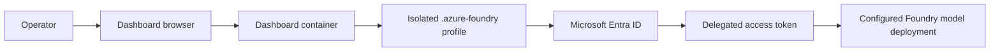

# Microsoft Foundry authentication for local Docker

The AI Assistant is optional. It uses Microsoft Entra device authentication and does not
store a Foundry API key.

## Configure

1. Open **AI Assistant** after the Azure Arc Observability Dashboard is configured.
2. Enter the Foundry tenant ID.
3. Start Foundry sign-in and complete the device-code prompt.
4. Enter the Azure OpenAI or Foundry resource endpoint.
5. Enter the model deployment name.
6. Save and run a simple read-only dashboard question.

Accepted endpoint hosts end with `.openai.azure.com` or `.services.ai.azure.com`. The
dashboard normalizes the endpoint to `/openai/v1`.

## Authorization

Assign the signed-in user `Cognitive Services OpenAI User` at the narrowest Foundry resource
scope. This role allows inference without granting resource-management permissions.

The Foundry profile is stored separately from the Arc profile:

| Profile | Purpose |
|---|---|
| `.azure/` | Shared Arc inventory and Azure Monitor reads |
| `.azure-foundry/` | Foundry inference token for the local operator |

Signing into one profile does not silently replace the other.

## Security answers

**Are API keys stored?** No. The dashboard requests delegated Entra access tokens through
Azure CLI.

**Are prompts sent outside Azure?** Prompts and bounded dashboard context are sent to the
configured Microsoft Foundry endpoint. Review the selected model and resource governance.

**Can the assistant modify Azure?** Dashboard tools are read-only and bounded. The Azure
identity should also be granted read-only roles.

**Can multiple people share this deployment?** No. The local Docker package is one-user
software and its browser cookie is not user authentication.

**What is persisted?** Azure CLI token cache and encrypted configuration are persisted in the
named volume. Protect backups and Docker administrator access.

## Troubleshooting

- Verify tenant ID is a GUID and matches the Foundry resource tenant.
- Verify the endpoint is HTTPS and uses an accepted Azure hostname.
- Verify the value is the deployment name, not the base model family name.
- Wait for RBAC propagation after assigning a role.
- Confirm outbound HTTPS and DNS to the Foundry endpoint.
- Use container logs for Azure CLI or HTTP error details; do not paste tokens into tickets.
