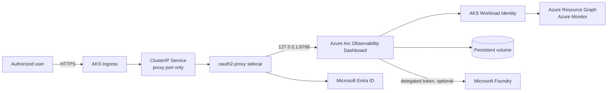

# Azure Arc Observability Dashboard on Azure Kubernetes Service

This package installs the shared Azure Arc Observability Dashboard container on AKS as a
singleton Helm release. Microsoft Entra ID authentication is enforced by an
`oauth2-proxy` sidecar before traffic reaches the dashboard.

> [!IMPORTANT]
> Install exactly one release for each dashboard scope. The chart hard-codes one replica,
> uses the `Recreate` strategy, and does not create an HPA. Multiple instances duplicate
> Azure Resource Graph and Log Analytics work and can corrupt shared persistent state.

## Start here

1. Read the [AKS configuration and operations guide](deploymentguide/dashboard-configuration-guide.md).
2. If the AI Assistant is required, also read the
   [Foundry authentication guide](deploymentguide/foundry-authentication-guide.md).
3. Copy `values.yaml` to an environment-specific file outside this package, supply the
   image, identity, ingress, and existing Secret names, and install with Helm.

## Architecture



The dashboard binds only to pod loopback. No Service port targets the dashboard container.
The proxy supplies trusted `X-Forwarded-*` request headers; the dashboard also accepts the
equivalent `X-Auth-Request-*` names used by alpha-config deployments. Both are trusted only
because the dashboard listener is reachable exclusively over pod loopback.

## Package contents

```text
AKS/
  Chart.yaml
  values.yaml
  values.schema.json
  templates/
    _helpers.tpl
    configmap.yaml
    deployment.yaml
    ingress.yaml
    networkpolicy.yaml
    pvc.yaml
    service.yaml
    serviceaccount.yaml
    NOTES.txt
  deploymentguide/
    dashboard-configuration-guide.md
    foundry-authentication-guide.md
```

## Prerequisites

- AKS with OIDC issuer and Workload Identity enabled.
- Helm 3.13 or later and `kubectl` access to the target cluster.
- A user-assigned managed identity with the required read-only Azure RBAC.
- A federated identity credential for the chart service account.
- An Entra app registration for `oauth2-proxy`.
- An existing Kubernetes Secret containing the OAuth client ID, client secret, and cookie
  secret.
- An ingress controller, DNS record, existing TLS Secret, and a `ReadWriteOnce` storage
  class.
- The shared dashboard image in a registry reachable from AKS.

## Configure secrets

The chart never creates credentials. Create the OAuth Secret through an approved secret
delivery process such as External Secrets, Secrets Store CSI Driver, sealed secrets, or a
one-time administrative command:

```powershell
kubectl -n arc-dashboard create secret generic arc-dashboard-oauth2-proxy `
  --from-literal=client-id='<entra-application-client-id>' `
  --from-literal=client-secret='<entra-client-secret>' `
  --from-literal=cookie-secret='<base64-cookie-secret>'
```

Generate the cookie value without storing it in source control:

```powershell
$bytes = [byte[]]::new(32)
[Security.Cryptography.RandomNumberGenerator]::Fill($bytes)
[Convert]::ToBase64String($bytes)
```

Use a certificate manager or create a separate existing TLS Secret named by
`ingress.tls.secretName`.

## Install

Create a private values file:

```yaml
image:
  repository: myregistry.azurecr.io/arc-dashboard
  tag: "2026.09.08"

workloadIdentity:
  clientId: "11111111-1111-1111-1111-111111111111"
  tenantId: "22222222-2222-2222-2222-222222222222"
  subscriptionId: "33333333-3333-3333-3333-333333333333"

dashboard:
  administratorUsers:
    - admin@contoso.com

oauth2Proxy:
  tenantId: "22222222-2222-2222-2222-222222222222"
  existingSecret: arc-dashboard-oauth2-proxy

ingress:
  className: nginx
  host: arc-dashboard.contoso.com
  tls:
    secretName: arc-dashboard-tls
```

Install and wait for the singleton pod:

```powershell
helm upgrade --install arc-dashboard .\deploy\kubernetes\AKS `
  --namespace arc-dashboard `
  --create-namespace `
  --values .\arc-dashboard.production.yaml
```

Browse to the configured host, sign in, and save the dashboard scope. Then validate the
rollout and security model:

```powershell
kubectl -n arc-dashboard rollout status deployment/arc-dashboard --timeout=10m
kubectl -n arc-dashboard get deploy,pod,service,ingress,pvc,networkpolicy
kubectl -n arc-dashboard get deploy arc-dashboard -o jsonpath='{.spec.replicas}'
kubectl -n arc-dashboard get service arc-dashboard -o yaml
kubectl -n arc-dashboard logs deployment/arc-dashboard -c dashboard --tail=100
kubectl -n arc-dashboard logs deployment/arc-dashboard -c oauth2-proxy --tail=100
```

The replica query must return `1`. The Service must contain only the proxy port.
The Service publishes the proxy endpoint during first-run setup even though dashboard
readiness correctly remains false until shared scope configuration is saved.

## Configuration contract

The chart configures the shared image entrypoint with these environment variables:

| Variable | Value |
|---|---|
| `ARC_DASHBOARD_BIND_ADDRESS` | `127.0.0.1` |
| `ARC_DASHBOARD_PORT` | `8766` |
| `ARC_DASHBOARD_DATA_ROOT` | `/var/lib/arc-dashboard` |
| `ARC_DASHBOARD_ACCESS_MODE` | `TrustedProxy` |
| `ARC_DASHBOARD_AZURE_AUTH_MODE` | `WorkloadIdentity` |
| `AZURE_CONFIG_DIR` | `/var/lib/arc-dashboard/.azure` |

The entrypoint launches the PowerShell dashboard with the corresponding bind, port, data,
and proxy-access modes. Do not override these values to expose the dashboard listener.

## Operations

```powershell
# Render locally
helm template arc-dashboard .\deploy\kubernetes\AKS `
  --namespace arc-dashboard `
  --values .\arc-dashboard.production.yaml

# Upgrade without overlapping pods
helm upgrade arc-dashboard .\deploy\kubernetes\AKS `
  --namespace arc-dashboard `
  --values .\arc-dashboard.production.yaml `
  --wait --timeout 10m

# Roll back; Recreate still prevents overlap
helm rollback arc-dashboard <revision> --namespace arc-dashboard --wait

# Uninstall (the PVC is retained by default)
helm uninstall arc-dashboard --namespace arc-dashboard
```

See the configuration guide for identity creation, Azure RBAC, backup and recovery,
certificate rotation, network policy customization, troubleshooting, and complete removal.

## Security defaults

- TLS ingress and secure OAuth cookies.
- Existing Secret references; no credentials in the chart.
- Dashboard listener restricted to pod loopback.
- Service and Ingress expose only `oauth2-proxy`.
- Workload Identity instead of a service-principal secret for Azure inventory.
- Non-root containers, read-only root filesystems, all capabilities dropped, runtime-default
  seccomp, and no privilege escalation.
- Persistent writes limited to `/var/lib/arc-dashboard`; temporary writes use an in-memory
  `/tmp`.
- Ingress restricted by NetworkPolicy and egress limited to DNS and HTTPS.
- PVC retained by default when the Helm release is removed.

Do not use `--set` for credentials because command history and Helm release metadata can
retain values.
