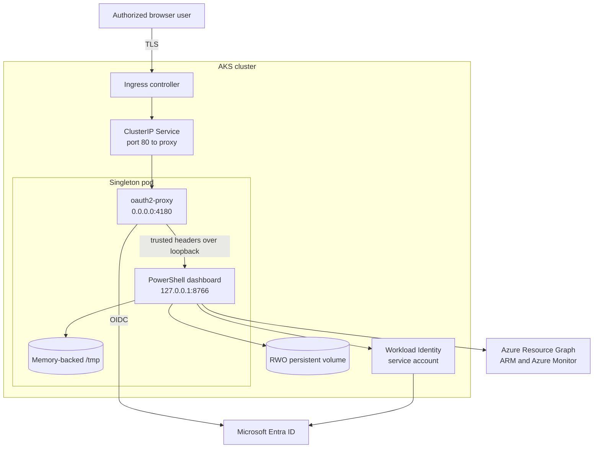
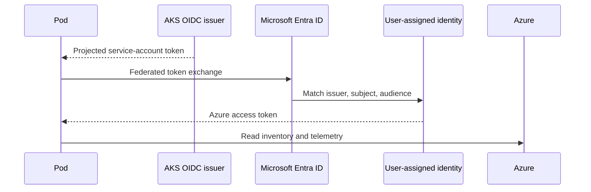

# AKS Dashboard Configuration and Operations Guide

This guide covers planning, identity, Azure RBAC, installation, configuration, upgrades,
backup, recovery, removal, troubleshooting, and security for the Azure Arc Observability Dashboard
Helm chart in `deploy\kubernetes\AKS`.

> [!IMPORTANT]
> The dashboard is a read-only operational console. It must run as exactly one pod for a
> configured Azure scope. Do not create an HPA, duplicate release, canary, or blue/green
> deployment.

## Contents

1. [Architecture and trust boundaries](#1-architecture-and-trust-boundaries)
2. [Prerequisites](#2-prerequisites)
3. [Plan identities and Azure RBAC](#3-plan-identities-and-azure-rbac)
4. [Prepare AKS Workload Identity](#4-prepare-aks-workload-identity)
5. [Prepare Entra authentication and secrets](#5-prepare-entra-authentication-and-secrets)
6. [Prepare DNS, TLS, ingress, and storage](#6-prepare-dns-tls-ingress-and-storage)
7. [Configure and install the chart](#7-configure-and-install-the-chart)
8. [Complete dashboard configuration](#8-complete-dashboard-configuration)
9. [Validate the deployment](#9-validate-the-deployment)
10. [Operate and monitor](#10-operate-and-monitor)
11. [Upgrade and roll back](#11-upgrade-and-roll-back)
12. [Backup and restore](#12-backup-and-restore)
13. [Remove the deployment](#13-remove-the-deployment)
14. [Troubleshooting](#14-troubleshooting)
15. [Security guidance](#15-security-guidance)

## 1. Architecture and trust boundaries



There are two independent authentication paths:

- **Human sign-in:** `oauth2-proxy` authenticates browser users through an Entra app
  registration and forwards trusted identity headers. The dashboard is not directly
  network-reachable.
- **Azure inventory identity:** the dashboard container exchanges the projected AKS
  Workload Identity token for an Azure token. No service-principal password is stored.

The optional Foundry path uses the signed-in user's delegated token and is described in the
Foundry guide.

## 2. Prerequisites

### Platform

- A supported AKS cluster with OIDC issuer and Workload Identity enabled.
- Kubernetes 1.27 or later.
- Helm 3.13 or later.
- `kubectl` and `az` authenticated for the intended cluster and Azure subscription.
- A NetworkPolicy-capable AKS network data plane.
- An installed ingress controller.
- DNS control for the dashboard hostname.
- A TLS certificate represented by an existing Kubernetes TLS Secret.
- A default or named CSI storage class supporting `ReadWriteOnce`.
- Registry connectivity and pull authorization for the shared dashboard image and
  `oauth2-proxy`.

### Network

The pod needs outbound DNS and HTTPS access to:

- `login.microsoftonline.com` and related Entra endpoints;
- Azure Resource Manager and Azure Resource Graph;
- Azure Monitor and Log Analytics query endpoints;
- the configured Foundry endpoint, when enabled;
- the container registry during image pull.

Private endpoints are supported only when AKS DNS and routing resolve them correctly. Update
`networkPolicy.egress.httpsCidrs` to the approved private address ranges when public HTTPS
egress is prohibited.

### Permissions for deployment

The installer needs Kubernetes permissions to create a Deployment, Service, ServiceAccount,
ConfigMap, PVC, Ingress, and NetworkPolicy in the target namespace. Azure identity and role
administrators need separate permissions described below.

## 3. Plan identities and Azure RBAC

Use distinct objects for the dashboard workload and browser authentication:

| Object | Purpose | Secret required |
|---|---|---|
| User-assigned managed identity | Shared Azure inventory and monitoring reads | No |
| Kubernetes service account | Federated subject for the managed identity | No |
| Entra app registration | Browser OIDC authentication | Client credential in existing Secret |
| Authorized users/groups | Dashboard access and optional Foundry inference | No |

Assign the managed identity at the narrowest practical scope:

| Dashboard function | Typical Azure role |
|---|---|
| Arc inventory and resource metadata | Reader |
| Log Analytics queries | Log Analytics Reader |
| Azure Monitor metrics and alerts | Monitoring Reader |

Owner and Contributor are not required for normal dashboard operation. Custom roles may be
used when they include the required read actions. Resource Graph and telemetry results are
always bounded by the managed identity's role assignments.

The users listed in `dashboard.administratorUsers` may save shared dashboard configuration.
Use normalized Entra user principal names matching the value in the `preferred_username`
claim. An empty administrator list intentionally prevents all users from changing shared
configuration.

## 4. Prepare AKS Workload Identity

Enable OIDC issuer and Workload Identity when creating the cluster, or update an existing
cluster:

```powershell
az aks update `
  --resource-group '<aks-resource-group>' `
  --name '<aks-name>' `
  --enable-oidc-issuer `
  --enable-workload-identity
```

Read the issuer URL:

```powershell
$Issuer = az aks show `
  --resource-group '<aks-resource-group>' `
  --name '<aks-name>' `
  --query oidcIssuerProfile.issuerUrl `
  --output tsv
```

Create or select a user-assigned managed identity:

```powershell
az identity create `
  --resource-group '<identity-resource-group>' `
  --name 'id-arc-dashboard'

$ClientId = az identity show `
  --resource-group '<identity-resource-group>' `
  --name 'id-arc-dashboard' `
  --query clientId --output tsv

$PrincipalId = az identity show `
  --resource-group '<identity-resource-group>' `
  --name 'id-arc-dashboard' `
  --query principalId --output tsv
```

Assign read roles. The following examples use subscription scope; resource-group scope is
preferred when practical:

```powershell
$Scope = "/subscriptions/<subscription-id>"
az role assignment create --assignee-object-id $PrincipalId `
  --assignee-principal-type ServicePrincipal --role Reader --scope $Scope
az role assignment create --assignee-object-id $PrincipalId `
  --assignee-principal-type ServicePrincipal --role 'Monitoring Reader' --scope $Scope
az role assignment create --assignee-object-id $PrincipalId `
  --assignee-principal-type ServicePrincipal --role 'Log Analytics Reader' --scope $Scope
```

The federated credential subject must match the Helm namespace and service account name:

```powershell
az identity federated-credential create `
  --resource-group '<identity-resource-group>' `
  --identity-name 'id-arc-dashboard' `
  --name 'arc-dashboard-aks' `
  --issuer $Issuer `
  --subject 'system:serviceaccount:arc-dashboard:arc-dashboard' `
  --audiences 'api://AzureADTokenExchange'
```

If the release name, namespace, `fullnameOverride`, or `serviceAccount.name` changes, update
the subject before deployment.



## 5. Prepare Entra authentication and secrets

Create a single-tenant Entra app registration for the dashboard:

1. Add a **Web** redirect URI:
   `https://<dashboard-host>/oauth2/callback`.
2. Create a client credential using organizational policy. Prefer a credential synchronized
   by an external secret controller and rotate it before expiration.
3. Configure assignment-required access or group restrictions when the application must not
   be available to every tenant user.
4. Add delegated Azure Cognitive Services `user_impersonation` permission if Foundry is
   enabled. Review and grant consent according to tenant policy.
5. Record the tenant ID and application client ID.

The existing Secret must have these default keys:

| Key | Content |
|---|---|
| `client-id` | Entra application client ID |
| `client-secret` | Entra client credential |
| `cookie-secret` | Random 32-byte base64 value |

Create it without writing values to a checked-in file:

```powershell
kubectl create namespace arc-dashboard --dry-run=client -o yaml | kubectl apply -f -
kubectl -n arc-dashboard create secret generic arc-dashboard-oauth2-proxy `
  --from-literal=client-id='<client-id>' `
  --from-literal=client-secret='<client-secret>' `
  --from-literal=cookie-secret='<base64-cookie-secret>'
```

For production, prefer Azure Key Vault plus Secrets Store CSI Driver or External Secrets.
The chart references the Secret but never reads or copies its values into a ConfigMap.

To restrict users by Entra group, add group object IDs to `oauth2Proxy.allowedGroups`.
Group claims and tenant configuration must support the selected users; test overage behavior
for users with many group memberships.

## 6. Prepare DNS, TLS, ingress, and storage

Create the dashboard DNS record pointing to the ingress endpoint. Provision a TLS Secret
through cert-manager, Key Vault integration, or another approved process:

```powershell
kubectl -n arc-dashboard get secret arc-dashboard-tls
```

The Secret must be type `kubernetes.io/tls`. The chart does not generate certificates.

Confirm the ingress controller labels before installing:

```powershell
kubectl get pods --all-namespaces --show-labels
```

Set `networkPolicy.ingress.namespaceSelector` and `podSelector` to the actual controller.
The defaults target a conventional ingress-nginx controller. A mismatched selector results
in an Ingress that exists but cannot connect to the proxy.

Choose a CSI storage class:

```powershell
kubectl get storageclass
```

The dashboard requires one writable volume mounted at `/var/lib/arc-dashboard`. The chart
creates a retained `ReadWriteOnce` PVC by default, or accepts `persistence.existingClaim`.
Use zone-aware storage and node placement appropriate for the cluster.

## 7. Configure and install the chart

Keep environment values outside the chart directory and never place credentials in them:

```yaml
image:
  repository: myregistry.azurecr.io/arc-dashboard
  tag: "2026.09.08"
  # Prefer digest pinning for production:
  # digest: sha256:<64-hex-character-digest>
  pullSecrets:
    - name: acr-pull

workloadIdentity:
  clientId: "<managed-identity-client-id>"
  tenantId: "<tenant-id>"
  subscriptionId: "<arc-subscription-id>"

dashboard:
  administratorUsers:
    - admin@contoso.com

oauth2Proxy:
  tenantId: "<tenant-id>"
  existingSecret: arc-dashboard-oauth2-proxy
  allowedGroups:
    - "<authorized-group-object-id>"

persistence:
  storageClassName: managed-csi
  size: 20Gi

ingress:
  className: nginx
  host: arc-dashboard.contoso.com
  tls:
    secretName: arc-dashboard-tls
```

Render before installation:

```powershell
helm lint .\deploy\kubernetes\AKS `
  --values .\arc-dashboard.production.yaml

helm template arc-dashboard .\deploy\kubernetes\AKS `
  --namespace arc-dashboard `
  --values .\arc-dashboard.production.yaml > .\arc-dashboard.rendered.yaml
```

Review the rendered image references, Service ports, ingress host, Secret references,
service-account annotations, PVC, NetworkPolicy, security contexts, and hard-coded replica
count. The rendered file contains identifiers but should not contain credentials.

Install:

```powershell
helm upgrade --install arc-dashboard .\deploy\kubernetes\AKS `
  --namespace arc-dashboard `
  --create-namespace `
  --values .\arc-dashboard.production.yaml
```

Readiness remains false until an administrator saves the dashboard scope. The Service uses
`publishNotReadyAddresses` so the authenticated setup page remains reachable through the
proxy during that first-run state. After saving configuration, wait for the rollout:

```powershell
kubectl -n arc-dashboard rollout status deployment/arc-dashboard --timeout=10m
```

## 8. Complete dashboard configuration

1. Browse to the HTTPS host.
2. Complete Entra authentication.
3. Verify the signed-in principal is an administrator listed in chart values.
4. Select the configured subscription.
5. Select the resource groups containing Arc resources.
6. Save the shared configuration.
7. Wait for the initial inventory and telemetry snapshot.
8. Configure Foundry only if required.

The dashboard workload is already signed in through Workload Identity. Browser users do not
perform Azure CLI device authentication for shared Arc inventory.

Persistent state includes encrypted configuration, local encryption material, Azure CLI
state, per-user monitoring baselines, and runtime data. Protect the PVC as sensitive
operational data.

## 9. Validate the deployment

```powershell
kubectl -n arc-dashboard get deployment arc-dashboard
kubectl -n arc-dashboard get pods
kubectl -n arc-dashboard get service arc-dashboard -o yaml
kubectl -n arc-dashboard get ingress arc-dashboard
kubectl -n arc-dashboard get pvc
kubectl -n arc-dashboard get networkpolicy arc-dashboard -o yaml
```

Validation checklist:

- Deployment replicas and ready replicas are exactly one.
- Strategy is `Recreate`.
- There is no HPA or KEDA ScaledObject.
- The pod has exactly `dashboard` and `oauth2-proxy` containers.
- The Service target is named port `proxy`; there is no dashboard Service port.
- The dashboard environment binds `127.0.0.1:8766`.
- Ingress TLS uses the expected host and Secret.
- Workload Identity labels and service-account annotations are present.
- Both containers run non-root with read-only root filesystems and dropped capabilities.
- The PVC is bound and mounted at `/var/lib/arc-dashboard`.
- NetworkPolicy selectors match the live ingress and DNS pods.

Test dashboard health from its own container because it is loopback-only:

```powershell
kubectl -n arc-dashboard exec deployment/arc-dashboard -c dashboard -- `
  pwsh -NoProfile -Command `
  'Invoke-WebRequest -UseBasicParsing http://127.0.0.1:8766/health/live'

kubectl -n arc-dashboard exec deployment/arc-dashboard -c dashboard -- `
  pwsh -NoProfile -Command `
  'Invoke-WebRequest -UseBasicParsing http://127.0.0.1:8766/health/ready'
```

`/health/live` indicates that the listener is alive. `/health/ready` returns 503 until shared
scope configuration is saved. Health payloads do not expose tenant, subscription, resource,
or token data.

## 10. Operate and monitor

Useful commands:

```powershell
kubectl -n arc-dashboard rollout status deployment/arc-dashboard
kubectl -n arc-dashboard logs deployment/arc-dashboard -c dashboard --tail=200
kubectl -n arc-dashboard logs deployment/arc-dashboard -c oauth2-proxy --tail=200
kubectl -n arc-dashboard describe pod -l app.kubernetes.io/name=arc-dashboard
helm history arc-dashboard --namespace arc-dashboard
```

Alert on unavailable replicas, container restarts, PVC capacity, TLS expiration, OAuth
credential expiration, and repeated authentication failures. Avoid logging ID or access
tokens. Kubernetes events and proxy logs may contain user identifiers and should follow the
organization's log-retention policy.

Rotate the OAuth client secret by updating the existing Secret and restarting the singleton:

```powershell
kubectl -n arc-dashboard rollout restart deployment/arc-dashboard
kubectl -n arc-dashboard rollout status deployment/arc-dashboard
```

The restart causes a brief outage by design.

## 11. Upgrade and roll back

1. Review release notes and image provenance.
2. Back up the PVC.
3. Pin the new dashboard and proxy images by immutable digest when possible.
4. Run `helm lint` and `helm template`.
5. Upgrade with `--wait`.
6. Validate authentication, configuration, inventory, monitoring, and Foundry.

```powershell
helm upgrade arc-dashboard .\deploy\kubernetes\AKS `
  --namespace arc-dashboard `
  --values .\arc-dashboard.production.yaml `
  --wait --timeout 10m
```

`Recreate` terminates the old pod before starting the new one. This produces downtime but
prevents concurrent access to `ReadWriteOnce` state and duplicate Azure queries.

Roll back when application and stored-state compatibility permits:

```powershell
helm history arc-dashboard --namespace arc-dashboard
helm rollback arc-dashboard <revision> --namespace arc-dashboard --wait --timeout 10m
```

Never work around an upgrade by scaling to two replicas.

## 12. Backup and restore

Use an AKS-supported CSI snapshot or organization-approved storage backup. Online CSI
snapshots are crash-consistent. Do not change the Deployment replica count for backup.

When an application-consistent maintenance backup is required, uninstall the release while
retaining its PVC, take the snapshot, and reinstall the same release and values. This
creates a planned outage without ever running an unsupported replica count or overlapping
dashboard instances.

Back up the complete volume. The encryption key and encrypted files must remain together.
Protect snapshots with encryption, RBAC, retention, and deletion controls. To restore:

1. Create a PVC from the approved snapshot.
2. Set `persistence.existingClaim` to that PVC.
3. Install or upgrade the singleton release.
4. Validate decryption, readiness, inventory, and monitoring data.

Do not mount one restored PVC into old and new releases at the same time.

## 13. Remove the deployment

Uninstall Helm resources:

```powershell
helm uninstall arc-dashboard --namespace arc-dashboard
```

With `persistence.retain: true`, the generated PVC remains. Confirm backups and then delete
it explicitly only when permanent data destruction is approved:

```powershell
kubectl -n arc-dashboard get pvc
kubectl -n arc-dashboard delete pvc arc-dashboard-data
```

Also remove, when no longer needed:

- the OAuth Secret and TLS Secret;
- DNS records and certificate resources;
- the federated identity credential;
- Azure role assignments and the managed identity;
- the Entra app registration or client credential;
- the namespace, after confirming it contains no unrelated resources.

Uninstalling the chart does not remove Azure resources or role assignments.

## 14. Troubleshooting

### Pod is pending

Inspect events and PVC state. Common causes are a missing storage class, zone constraints,
image pull authorization, quota, or node selectors:

```powershell
kubectl -n arc-dashboard describe pod -l app.kubernetes.io/name=arc-dashboard
kubectl -n arc-dashboard describe pvc
```

### Workload Identity login fails

Verify AKS OIDC and Workload Identity are enabled, the pod label is present, the service
account client/tenant annotations are correct, and the federated credential issuer, subject,
and audience match exactly. Allow time for Azure RBAC propagation.

### OAuth redirects loop or return an error

Verify the ingress host, TLS certificate, Entra redirect URI, tenant ID, client ID, client
secret, and system clock. The redirect URI must exactly match
`https://<host>/oauth2/callback`. Review proxy logs without copying tokens into tickets.

### Ingress returns 502 or times out

Confirm the Service selects the pod, proxy readiness is healthy, and NetworkPolicy selectors
match the actual ingress controller namespace and labels. Do not add a Service port for the
dashboard as a workaround.

### Readiness stays false

Before initial setup, 503 is expected. After setup, inspect dashboard logs, verify the PVC is
writable by UID/GID `10001`, and look for configuration decryption or Azure authorization
errors.

### Only some resources appear

Verify subscription and selected resource groups, then inspect managed-identity role
assignments. Resource Graph indexing and Log Analytics ingestion can lag recent changes.

### Foundry calls fail

Follow the Foundry guide. Confirm delegated API permission, user RBAC, endpoint, deployment
name, and outbound HTTPS.

### Read-only filesystem errors

The application may write only to `/var/lib/arc-dashboard` and `/tmp`. Do not disable the
read-only root filesystem. Correct the image entrypoint or mount path instead.

## 15. Security guidance

- Pin both images by digest and verify registry provenance.
- Use Azure Policy, admission controls, and image scanning.
- Keep exactly one replica with `Recreate`.
- Keep the dashboard on `127.0.0.1`; expose only the proxy Service.
- Restrict Entra application assignment or `allowedGroups`.
- Use short-lived or automatically rotated OAuth credentials in an existing Secret.
- Limit the managed identity to read-only roles and narrow scopes.
- Retain TLS end to end to the ingress boundary and enforce modern TLS policy there.
- Keep NetworkPolicy enabled and replace broad HTTPS CIDRs with approved egress ranges or a
  controlled firewall where practical.
- Protect PVC snapshots because possession of the local key and encrypted files permits
  decryption.
- Restrict `kubectl exec`, secret read, pod create, and persistent-volume access.
- Review administrator UPNs and group memberships regularly.
- Do not pass credentials through Helm values, command-line `--set`, ConfigMaps, or source
  control.
- Treat OAuth access tokens forwarded to the dashboard as sensitive and never log them.
