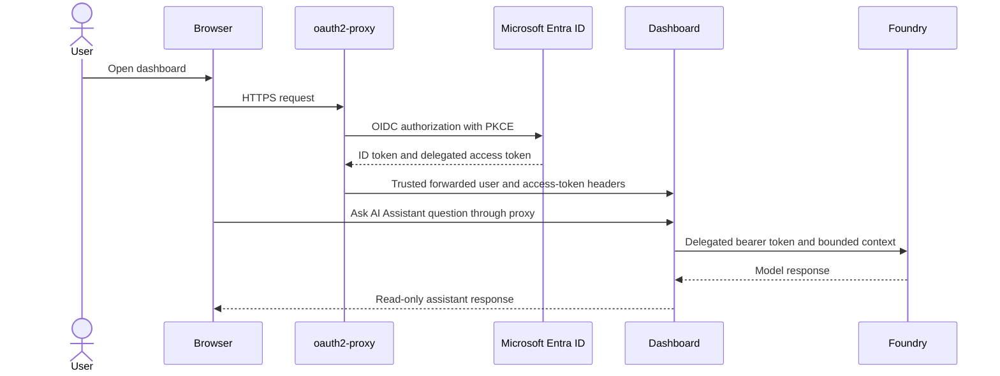
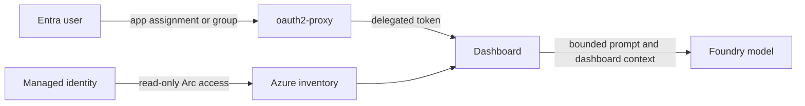

# Microsoft Foundry Authentication for AKS

The Azure Arc Observability Dashboard AI Assistant is optional. In AKS `TrustedProxy` mode it uses the signed-in
browser user's delegated Microsoft Entra token for Foundry inference. The shared Workload
Identity remains responsible for Arc inventory and Azure Monitor reads.

No Foundry API key is required or stored.

## Identity flow



The access token is held in memory for the authenticated user session. Persistent dashboard
configuration contains the Foundry endpoint, tenant, and model deployment name, but no API
key.

## Prerequisites

- A Microsoft Foundry or Azure OpenAI resource reachable from AKS.
- A chat-completions-compatible model deployment with tool/function calling.
- An accepted HTTPS endpoint ending in `.openai.azure.com` or `.services.ai.azure.com`.
- The Entra app registration used by `oauth2-proxy`.
- Delegated Microsoft Foundry access represented by the `https://ai.azure.com/.default`
  scope on that app.
- Tenant consent according to organizational policy.
- Each authorized user assigned `Cognitive Services OpenAI User` at the narrowest Foundry
  resource scope.
- Outbound HTTPS from the dashboard pod to the Foundry endpoint.

## Configure the Entra application

In the app registration used by `oauth2-proxy`:

1. Open **API permissions**.
2. Add the delegated Microsoft Foundry permission represented by
   `https://ai.azure.com/.default`.
3. Grant administrator consent if tenant policy requires it.
4. Keep the existing OIDC redirect URI:
   `https://<dashboard-host>/oauth2/callback`.
5. Restrict application assignment to approved users or groups.

The chart's default proxy scopes are:

```text
openid profile email offline_access https://ai.azure.com/.default
```

Do not remove the Cognitive Services scope when the AI Assistant is enabled. If Foundry is
not used, it may be removed from `oauth2Proxy.scopes` to reduce delegated consent.

## Assign Foundry RBAC

Assign inference permission to each user or an approved Entra group:

```powershell
$FoundryScope = '/subscriptions/<subscription-id>/resourceGroups/<resource-group>/providers/Microsoft.CognitiveServices/accounts/<account-name>'

az role assignment create `
  --assignee '<user-or-group-object-id>' `
  --role 'Cognitive Services OpenAI User' `
  --scope $FoundryScope
```

This is user RBAC, not the dashboard managed identity's RBAC. The managed identity does not
need Foundry inference permission for the delegated AKS flow.

Allow time for role assignment and consent propagation before testing.

## Configure the dashboard

1. Sign in through the dashboard HTTPS endpoint.
2. Open **AI Assistant**.
3. Enter the tenant containing the Foundry resource.
4. Enter the Foundry or Azure OpenAI endpoint.
5. Enter the model deployment name, not the base model family.
6. Save the configuration.
7. Run a simple read-only question and verify the response.

Only dashboard administrators can change shared Foundry configuration. Authorized
non-administrator users can use the configured assistant when their delegated identity has
Foundry inference permission.

## Network and private endpoint considerations

For a public Foundry endpoint, the NetworkPolicy allows outbound TCP 443. Organizations that
use Azure Firewall or an egress proxy must permit the Foundry hostname and Entra token
endpoints.

For a private endpoint:

- link the private DNS zone to the AKS virtual network;
- verify the pod resolves the endpoint to the private address;
- include the private CIDR in `networkPolicy.egress.httpsCidrs`;
- ensure NSGs, user-defined routes, and firewalls allow TCP 443; and
- keep public access disabled if required by policy.

Test resolution and TLS from the dashboard container using approved diagnostic procedures.
Do not print bearer tokens.

## Security model



- The proxy is the only network entry point.
- The dashboard accepts the trusted identity only from the same-pod proxy over loopback.
- OAuth cookies are Secure, HttpOnly, SameSite, and use the `__Host-` prefix by default.
- PKCE is enabled.
- The access token is not placed in Helm values, ConfigMaps, or the PVC by the chart.
- Prompts and bounded dashboard context are sent to the configured Foundry deployment.
- Dashboard tools are read-only, but Azure RBAC remains the final authorization boundary.

Review model data handling, regional processing, content filtering, logging, and retention
against organizational policy before enabling the assistant.

## Rotation and lifecycle

Rotate the OAuth client credential in the existing Kubernetes Secret, then restart the
singleton deployment:

```powershell
kubectl -n arc-dashboard rollout restart deployment/arc-dashboard
kubectl -n arc-dashboard rollout status deployment/arc-dashboard
```

Existing sessions are invalidated when the cookie secret changes. Plan a maintenance window.
Review app permissions, app assignments, group memberships, Foundry role assignments, and
model deployment lifecycle regularly.

To disable Foundry:

1. Remove shared Foundry configuration through the dashboard.
2. Remove the Cognitive Services delegated scope from `oauth2Proxy.scopes`.
3. Upgrade the Helm release.
4. Remove user/group Foundry role assignments if no longer needed.

## Troubleshooting

### The proxy reports consent or scope errors

Confirm Microsoft Foundry delegated access is configured, tenant consent is complete, and
the chart requests the exact `https://ai.azure.com/.default` scope used by the
dashboard runtime.

### The dashboard reports no delegated token

Confirm `--pass-user-headers=true` and `--pass-access-token=true` remain in the rendered
proxy arguments. The dashboard accepts oauth2-proxy's `X-Forwarded-User` and
`X-Forwarded-Access-Token` request headers. Do not expose the dashboard directly or
synthesize authentication headers.

### Foundry returns 401

The token may have the wrong audience, be expired, or come from the wrong tenant. Sign out,
sign back in, verify the configured OAuth scope and tenant, and inspect sanitized proxy and
dashboard logs.

### Foundry returns 403

Verify the signed-in user has `Cognitive Services OpenAI User` on the correct resource and
that role propagation has completed. Assigning the role only to the AKS managed identity
does not authorize delegated users.

### Endpoint validation fails

Use an HTTPS endpoint on an accepted Azure hostname. Enter the resource endpoint rather than
a portal URL, project page, or full chat-completions path.

### Deployment or model is not found

Verify the deployment name, region, resource, API compatibility, and model lifecycle. A
model family name is not necessarily the deployment name.

### Private endpoint is unreachable

Check pod DNS, private DNS links, routes, firewall rules, NetworkPolicy CIDRs, and TLS name
validation. Do not bypass TLS verification.

When collecting diagnostics, redact user identifiers as required and never include access
tokens, client secrets, cookie secrets, or unredacted Kubernetes Secret content.
