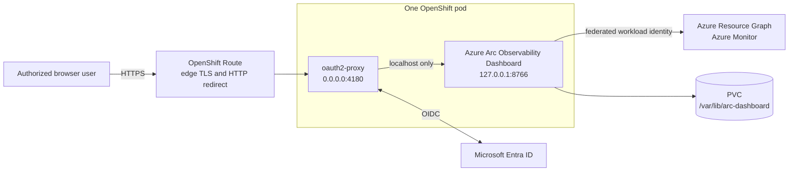

# Azure Arc Observability Dashboard for Red Hat OpenShift

This folder is a self-contained Helm deployment package for running the shared
Azure Arc Observability Dashboard container image on Red Hat OpenShift. It adds the
OpenShift-specific Route, Microsoft Entra authentication proxy, workload
identity, persistent storage, and network controls required for shared access.

> [!IMPORTANT]
> Install exactly one replica for an Azure scope. The chart fixes
> `replicas: 1`, uses the `Recreate` strategy, and intentionally provides no
> autoscaler. A second instance would duplicate Azure queries and create
> conflicting persistent monitoring state.

## Start here

Read the packaged guides before installing:

1. [OpenShift Dashboard Configuration and Operations Guide](deploymentguide/dashboard-configuration-guide.md) -
   architecture, prerequisites, Entra identities, Azure RBAC, installation,
   configuration, health, upgrade, backup, removal, troubleshooting, storage,
   SELinux, and security.
2. [Microsoft Foundry Authentication Guide](deploymentguide/foundry-authentication-guide.md) -
   delegated Entra authentication, Foundry RBAC, model configuration, token
   flow, validation, and troubleshooting.

The configuration guide is the primary deployment document. The Foundry guide
is required only when the AI Assistant will be enabled.

## Architecture



Only oauth2-proxy is exposed through the Service. The dashboard listener binds
to pod localhost and cannot be reached through a Service, Route, or another
pod. oauth2-proxy supplies the trusted identity headers required by the
dashboard's multi-user mode.

## Package contents

```text
OpenShift/
  .helmignore
  Chart.yaml
  values.yaml
  values.schema.json
  README.md
  templates/
    _helpers.tpl
    configmap.yaml
    deployment.yaml
    networkpolicy.yaml
    NOTES.txt
    pvc.yaml
    route.yaml
    service.yaml
    serviceaccount.yaml
  deploymentguide/
    dashboard-configuration-guide.md
    foundry-authentication-guide.md
```

The chart creates:

- one `Deployment` with one dashboard container and one oauth2-proxy sidecar;
- one `ServiceAccount` with an explicitly projected Azure federation token;
- one non-secret `ConfigMap`;
- one `PersistentVolumeClaim`;
- one proxy-only `Service`;
- one edge-terminated TLS `Route` with HTTP-to-HTTPS redirect; and
- one ingress-and-egress `NetworkPolicy`.

It does not create credentials, an HPA, a privileged SCC, a host mount, or an
externally reachable dashboard port.

## Requirements

- OpenShift 4.14 or later with the `restricted-v2` SCC
- Helm 3.12 or later and `oc`
- A default or explicitly selected CSI `StorageClass`
- An approved registry containing the shared Azure Arc Observability Dashboard image
- An OpenShift service-account OIDC issuer reachable by Microsoft Entra ID
- A central Entra application/service principal for Azure workload identity
- A separate Entra web application for oauth2-proxy
- An existing Kubernetes `Secret` containing the proxy client secret and
  cookie secret
- DNS for the requested Route hostname
- Outbound DNS and HTTPS access to Microsoft Entra ID, Azure APIs, Log
  Analytics/Azure Monitor, and optional Foundry endpoints

## Quick installation outline

1. Create a project:

   ```bash
   oc new-project arc-dashboard
   ```

2. Configure the central Azure identity and its federated credential for:

   ```text
   system:serviceaccount:arc-dashboard:arc-dashboard-arc-dashboard-openshift
   ```

   The exact subject changes when a different Helm release or service-account
   name is used.

3. Configure the oauth2-proxy Entra app redirect URI:

   ```text
   https://arc-dashboard.apps.example.com/oauth2/callback
   ```

4. Deliver the proxy credentials as an existing Secret named
   `arc-dashboard-oauth` with keys `client-secret` and `cookie-secret`.

5. Copy `values.yaml` to an operator-controlled values file and replace all
   example hostnames, image settings, GUIDs, and administrator identities. Do
   not add secret values to that file.

6. Validate and install:

   ```bash
   helm lint .
   helm template arc-dashboard . \
     --namespace arc-dashboard \
     --values values-production.yaml > rendered.yaml
   helm upgrade --install arc-dashboard . \
     --namespace arc-dashboard \
     --values values-production.yaml
   ```

7. Browse to the configured Route, sign in with Entra ID, and have an identity
   listed in `dashboard.administratorUsers` save the subscription and
   resource-group scope. Then confirm the Deployment becomes Available:

   ```bash
   oc rollout status deployment/arc-dashboard-arc-dashboard-openshift \
     -n arc-dashboard --timeout=10m
   ```

Read the
[complete configuration guide](deploymentguide/dashboard-configuration-guide.md)
before applying the chart to production.

## Security defaults

- OpenShift assigns the runtime UID and SELinux label; no UID or GID is fixed.
- Both containers run non-root, drop every Linux capability, deny privilege
  escalation, use `RuntimeDefault` seccomp, and have read-only root filesystems.
- Writable paths are limited to the PVC and per-container memory-backed
  `emptyDir` mounts at `/tmp`.
- No `hostPath`, privileged container, host networking, or custom SCC is used.
- The Service exposes only oauth2-proxy on port `4180`.
- The Route redirects plaintext HTTP to HTTPS and enables HSTS by default.
- Proxy secrets are referenced from an existing Secret and are never rendered
  into chart resources.
- oauth2-proxy is pinned because the required upstream identity-header
  injection uses its versioned alpha configuration schema. Validate that
  schema before every proxy image upgrade.
- Dashboard state is stored only under `/var/lib/arc-dashboard`.

## Common operations

```bash
# Workload and health
oc get deployment,pod,service,route,pvc -n arc-dashboard
oc describe pod -n arc-dashboard -l app.kubernetes.io/instance=arc-dashboard

# Logs
oc logs -n arc-dashboard deployment/arc-dashboard-arc-dashboard-openshift \
  -c dashboard --tail=200
oc logs -n arc-dashboard deployment/arc-dashboard-arc-dashboard-openshift \
  -c oauth2-proxy --tail=200

# Upgrade without overlapping instances
helm upgrade arc-dashboard . \
  -n arc-dashboard \
  -f values-production.yaml \
  --wait --timeout 10m

# Remove Kubernetes objects; retained PVC remains
helm uninstall arc-dashboard -n arc-dashboard
```

Do not scale the Deployment above one replica. Back up the PVC before an
upgrade or removal and delete the retained PVC only when its encrypted
configuration, token cache, encryption key, and monitoring state are no longer
required.
