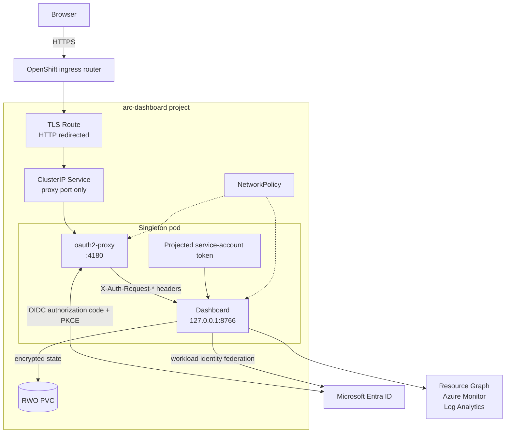
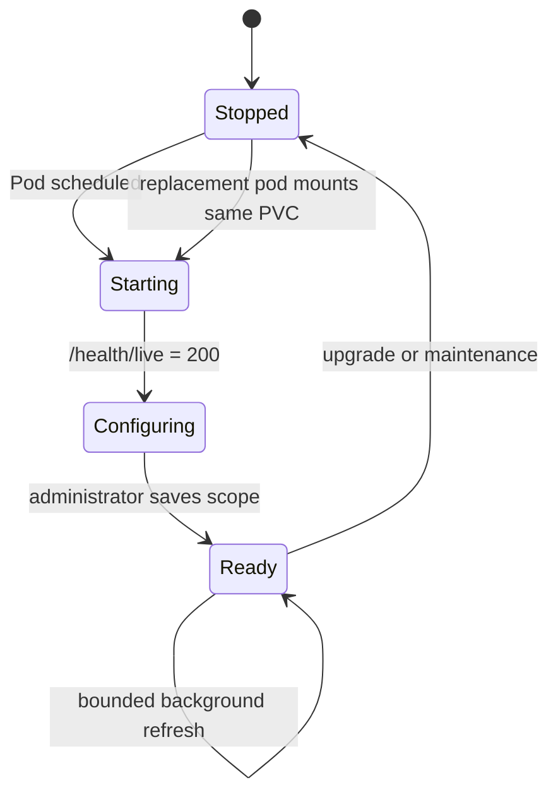

# OpenShift Dashboard Configuration and Operations Guide

This guide explains how to deploy, configure, secure, validate, upgrade, back
up, and remove the Azure Arc Observability Dashboard on Red Hat OpenShift. It is
intended for OpenShift administrators, Microsoft Entra administrators, Azure
platform teams, and operators responsible for Azure Arc and Azure Monitor.

> [!IMPORTANT]
> The dashboard is a read-only operational console. Azure authorization is
> supplied by one central workload identity. Every authenticated dashboard
> user can view data available to that identity, so control access to the
> oauth2-proxy enterprise application as carefully as Azure RBAC.

## Contents

1. [Architecture and trust boundaries](#1-architecture-and-trust-boundaries)
2. [Prerequisites and planning](#2-prerequisites-and-planning)
3. [Create the identities and Azure RBAC](#3-create-the-identities-and-azure-rbac)
4. [Prepare OpenShift](#4-prepare-openshift)
5. [Configure the chart](#5-configure-the-chart)
6. [Install and validate](#6-install-and-validate)
7. [Configure the dashboard](#7-configure-the-dashboard)
8. [Health and routine operations](#8-health-and-routine-operations)
9. [Upgrade and rollback](#9-upgrade-and-rollback)
10. [Backup and recovery](#10-backup-and-recovery)
11. [Removal](#11-removal)
12. [Troubleshooting](#12-troubleshooting)
13. [Security guidance](#13-security-guidance)
14. [SELinux and storage notes](#14-selinux-and-storage-notes)
15. [Production validation checklist](#15-production-validation-checklist)

## 1. Architecture and trust boundaries

The chart is an OpenShift adapter around the shared dashboard image:



### Trust boundaries

- **OpenShift Route:** public or corporate-network TLS endpoint. Edge TLS
  terminates at the router; plaintext traffic is permitted only from the
  router to the proxy Service inside the cluster.
- **oauth2-proxy:** the only network listener exposed by a Service. It
  authenticates users and forwards a normalized identity and delegated access
  token to the dashboard.
- **Dashboard listener:** binds to `127.0.0.1` inside the pod. Even a pod in the
  same namespace cannot connect directly to port `8766`.
- **Central Azure identity:** performs shared Arc inventory, Resource Graph,
  Azure Monitor, and Log Analytics reads. It uses an Entra federated
  credential, not a stored client secret.
- **Persistent state:** configuration, Azure CLI state, encryption key, and
  monitoring data are under `/var/lib/arc-dashboard` on the PVC.

### Singleton request model

The dashboard centralizes refresh and local monitoring state. The Deployment
therefore has exactly one replica and `Recreate` strategy:



Do not add an HPA, KEDA object, canary release, blue/green overlap, or another
Helm release for the same PVC or Azure scope.

## 2. Prerequisites and planning

### 2.1 OpenShift prerequisites

- OpenShift 4.14 or later.
- Permission to create Deployments, Services, Routes, NetworkPolicies,
  ServiceAccounts, ConfigMaps, and PVCs in a project.
- Helm 3.12 or later and a compatible `oc` client.
- The standard `restricted-v2` SCC available to namespace workloads.
- A CSI-backed `StorageClass` supporting `ReadWriteOnce`, filesystem volumes,
  OpenShift-assigned UIDs/groups, and SELinux labeling.
- An ingress controller whose namespace matches the NetworkPolicy selector
  `network.openshift.io/policy-group=ingress`, or a chart override matching
  local labels.
- DNS resolving the selected Route host to the ingress controller.

### 2.2 Image prerequisites

Build and publish the shared Azure Arc Observability Dashboard image using the repository's
container package. Use an approved registry, vulnerability scanning, and an
immutable tag or digest. The image must:

- contain PowerShell 7 and Azure CLI;
- make application files world-readable but not writable;
- allow an OpenShift-assigned runtime UID;
- write runtime state only below `/var/lib/arc-dashboard`; and
- expose the existing entrypoint used by the shared container package.

The chart never builds an image and never installs software at pod startup.

### 2.3 Network prerequisites

Allow pod egress on TCP `443` and DNS to:

- `login.microsoftonline.com` and other approved Microsoft Entra endpoints;
- Azure Resource Manager and Azure Resource Graph;
- Azure Monitor and Log Analytics query endpoints;
- the configured Microsoft Foundry endpoint, when enabled; and
- the OpenID Connect issuer and endpoints needed by oauth2-proxy.

The default NetworkPolicy permits DNS to the `openshift-dns` namespace and
IPv4 HTTPS to `0.0.0.0/0`. Replace that broad HTTPS CIDR with approved egress
proxy, firewall, Private Link, or destination CIDRs when the platform provides
stable addresses. Add `::/0` only when IPv6 egress is required.

### 2.4 Identity plan

Use two separate Entra applications:

| Identity | Credential | Purpose |
|---|---|---|
| Dashboard workload identity | OpenShift projected service-account token plus Entra federated credential | Shared Arc inventory, Resource Graph, Monitor, and Log Analytics reads |
| oauth2-proxy web app | Client secret held in an existing OpenShift Secret | Interactive user authentication and optional delegated Foundry token |

Do not reuse the oauth2-proxy client secret as the dashboard identity
credential. Do not put credentials in `values.yaml`, a ConfigMap, a Git
repository, or a rendered manifest.

### 2.5 Azure permissions

Assign the central dashboard service principal at the narrowest practical
scope:

| Dashboard function | Typical Azure role |
|---|---|
| Arc resource inventory and metadata | `Reader` on selected resource groups or subscription |
| Log Analytics queries | `Log Analytics Reader` on each workspace |
| Metrics, alerts, and monitoring details | `Monitoring Reader` where required |
| Defender posture | Appropriate read access to Defender for Cloud recommendations |
| Arc-enabled SQL and Kubernetes details | Read access to the applicable Arc resource types |

The dashboard identity does not need `Owner`, `Contributor`, or `User Access
Administrator`. Use custom roles if organizational policy requires narrower
actions.

## 3. Create the identities and Azure RBAC

### 3.1 Record the OpenShift service-account issuer

Create the project first:

```bash
oc new-project arc-dashboard
oc get authentication.config.openshift.io cluster \
  -o jsonpath='{.spec.serviceAccountIssuer}{"\n"}'
```

The issuer must be HTTPS and its discovery document and signing keys must be
reachable by Microsoft Entra ID. Private or disconnected clusters need an
organization-approved externally reachable issuer/broker design before this
package can use Entra workload identity federation.

### 3.2 Create the central dashboard application

Create or select an Entra application and service principal. Record:

- tenant ID;
- application/client ID; and
- Azure subscription ID.

Create a federated identity credential with:

| Field | Value |
|---|---|
| Issuer | OpenShift service-account issuer |
| Subject | `system:serviceaccount:arc-dashboard:arc-dashboard-arc-dashboard-openshift` |
| Audience | `api://AzureADTokenExchange` |

The subject is exact and case-sensitive. If the Helm release, project, or
`serviceAccount.name` changes, update the subject before installation.

Assign the Azure read roles from section 2.5 to this service principal. Allow
time for RBAC and federated-credential propagation.

### 3.3 Create the oauth2-proxy web application

Configure a confidential Entra web application:

1. Add the exact web redirect URI:

   ```text
   https://arc-dashboard.apps.example.com/oauth2/callback
   ```

2. Create a client secret using the organization's credential lifecycle
   policy.
3. Configure tenant-only access unless multitenant access is explicitly
   approved.
4. Require assignment to the Enterprise Application and assign only approved
   users or groups.
5. Ensure the ID token provides `preferred_username`. The chart maps that claim
   to `X-Auth-Request-User`.
6. If Foundry will be used, add and consent to the delegated Azure Cognitive
   Services `user_impersonation` permission described in the Foundry guide.

Record the proxy application/client ID. The client secret is stored only in
the existing OpenShift Secret.

The chart uses oauth2-proxy's generic OIDC provider with a tenant-specific
issuer. Microsoft Entra ID does not emit the standard `email_verified` claim,
so the provider permits the `preferred_username` email claim without that
flag. This does not disable token signature, issuer, audience, nonce, or
expiration validation. Keep the issuer tenant-specific and require Enterprise
Application assignment; do not replace it with `common` or disable issuer
verification.

## 4. Prepare OpenShift

### 4.1 Create or select the project

```bash
oc new-project arc-dashboard
oc project arc-dashboard
```

Use a dedicated project so Route access, secrets, egress policy, quotas, and
operator permissions can be audited independently.

### 4.2 Verify the SCC

The chart requires only `restricted-v2`:

```bash
oc adm policy who-can use scc restricted-v2
oc get scc restricted-v2
```

Do not grant `anyuid`, `privileged`, host access, or a custom SCC. Admission
must assign the runtime UID, group, and SELinux context.

After installation, verify the admitted SCC:

```bash
oc get pod -l app.kubernetes.io/instance=arc-dashboard \
  -o jsonpath='{.items[0].metadata.annotations.openshift\.io/scc}{"\n"}'
```

### 4.3 Select storage

List storage classes:

```bash
oc get storageclass
```

Choose CSI storage that supports:

- `ReadWriteOnce`;
- volume snapshots or another approved backup mechanism;
- filesystem ownership changes for the namespace-assigned group; and
- SELinux mount labeling on OpenShift nodes.

The default request is `10Gi`. Estimate growth for Azure CLI caches,
configuration, per-user monitoring snapshots, retention, and backup policy.

### 4.4 Create the proxy Secret

The chart references an existing Secret and never generates one. The default
contract is:

```text
Secret name: arc-dashboard-oauth
Keys:
  client-secret
  cookie-secret
```

Generate a high-entropy cookie secret accepted by oauth2-proxy, and deliver
both values through the organization's approved secret manager, External
Secrets operator, sealed-secret workflow, or controlled `oc create secret`
process. Never commit either value.

Verify only metadata and key names:

```bash
oc describe secret arc-dashboard-oauth
```

Rotate the client secret and cookie secret through the external secret source,
then restart the Deployment. Rotating the cookie secret signs out all users.

## 5. Configure the chart

Copy `values.yaml` to a deployment-controlled file outside the reusable chart
directory, for example `values-production.yaml`. Replace at least:

```yaml
image:
  repository: registry.example.com/platform/arc-operations-dashboard
  tag: "2026.09.0"
  # Prefer a verified digest for production:
  # digest: sha256:...

azureIdentity:
  tenantId: "<central-tenant-guid>"
  clientId: "<dashboard-workload-identity-client-guid>"
  subscriptionId: "<arc-subscription-guid>"

oauth2Proxy:
  clientId: "<proxy-web-app-client-guid>"
  existingSecret:
    name: arc-dashboard-oauth
    clientSecretKey: client-secret
    cookieSecretKey: cookie-secret

dashboard:
  administratorUsers:
    - arc-dashboard-admin@example.com

route:
  host: arc-dashboard.apps.example.com

persistence:
  storageClass: managed-csi
  size: 20Gi
```

Administrator names are normalized to lowercase by the dashboard and must
match oauth2-proxy's `X-Auth-Request-User` value. Configure at least two
operational administrators where separation-of-duties policy permits.

### Route TLS

The default `edge` Route uses the ingress controller's certificate and
redirects HTTP to HTTPS. To use a route-specific certificate, set
`route.tls.certificate` and `route.tls.key` through a protected values delivery
mechanism. Because those values become Route fields, prefer cluster-managed
wildcard certificates or a GitOps secret-injection mechanism over committing
private key material.

### NetworkPolicy customization

Inspect local labels:

```bash
oc get namespace openshift-ingress --show-labels
oc get namespace openshift-dns --show-labels
oc get pod -n openshift-dns --show-labels
```

Override the ingress or DNS selectors when they differ. Add private egress,
proxy, or IPv6 rules with `networkPolicy.additionalEgress`. Keep ingress
restricted to the OpenShift router and proxy port.

## 6. Install and validate

### 6.1 Render before applying

Run from this OpenShift chart directory:

```bash
helm lint .
helm template arc-dashboard . \
  --namespace arc-dashboard \
  --values values-production.yaml > rendered.yaml
```

Review the rendered manifest:

- Deployment has `replicas: 1` and `strategy.type: Recreate`.
- There are exactly two containers.
- No `runAsUser`, `runAsGroup`, privileged mode, `hostPath`, HPA, or Secret
  resource is present.
- The dashboard bind address is `127.0.0.1`.
- The Service target port is `proxy`, not `dashboard`.
- The Route redirects insecure traffic.

Perform server-side validation when policy permits:

```bash
oc apply --dry-run=server -f rendered.yaml
```

Delete `rendered.yaml` after review if it is not an approved deployment
artifact.

### 6.2 Install

```bash
helm upgrade --install arc-dashboard . \
  --namespace arc-dashboard \
  --values values-production.yaml
```

The dashboard readiness endpoint returns `503` until initial scope is saved.
The Service uses `publishNotReadyAddresses: true` so the authenticated Route
remains usable for first-run configuration; oauth2-proxy readiness and Entra
authentication still protect the endpoint. Do not use Helm `--wait` for the
first installation because readiness intentionally depends on browser
configuration.

### 6.3 Validate resources

```bash
oc get deployment,pod,service,route,pvc,networkpolicy \
  -l app.kubernetes.io/instance=arc-dashboard
oc get deployment arc-dashboard-arc-dashboard-openshift \
  -o jsonpath='{.spec.replicas}{" "}{.spec.strategy.type}{"\n"}'
oc get service arc-dashboard-arc-dashboard-openshift -o yaml
oc get route arc-dashboard-arc-dashboard-openshift -o yaml
```

Expected deployment output:

```text
1 Recreate
```

Confirm the dashboard process is listening only on localhost from the pod:

```bash
oc rsh -c dashboard deployment/arc-dashboard-arc-dashboard-openshift \
  pwsh -NoProfile -Command \
  "(Invoke-WebRequest http://127.0.0.1:8766/health/live).StatusCode"
```

Do not expose or port-forward dashboard port `8766`. Test user access through
the TLS Route and oauth2-proxy.

## 7. Configure the dashboard

1. Open `https://<route-host>/`.
2. Authenticate through Microsoft Entra ID.
3. Confirm the signed-in identity is assigned to the proxy Enterprise
   Application.
4. Use an identity listed in `dashboard.administratorUsers`.
5. Confirm Azure CLI is already authenticated by workload identity. Do not
   start device-code authentication for the shared Arc scope.
6. Select the configured subscription.
7. Select every resource group containing the Arc servers and Arc-enabled
   Kubernetes resources that should appear.
8. Save the configuration and wait for the first bounded snapshot.
9. Verify `/health/ready` changes to HTTP `200`.
10. Configure Foundry only if required and after reading the Foundry guide.

Confirm the Deployment becomes Available:

```bash
oc rollout status deployment/arc-dashboard-arc-dashboard-openshift \
  -n arc-dashboard --timeout=10m
```

The central identity determines which subscriptions, resource groups,
workspaces, and resource details are available. oauth2-proxy user identity
controls dashboard access and administrator operations; it does not replace
the central Azure RBAC identity for inventory.

## 8. Health and routine operations

| Endpoint | Checked by | Meaning |
|---|---|---|
| Dashboard `/health/live` | startup and liveness exec probes over pod localhost | PowerShell listener is alive |
| Dashboard `/health/ready` | readiness exec probe over pod localhost | Dashboard scope is saved |
| oauth2-proxy `/ping` | sidecar liveness probe | Proxy process is alive |
| oauth2-proxy `/ready` | sidecar readiness probe | Proxy can serve requests |

Health payloads contain no tokens, tenant IDs, subscription IDs, or resource
names.

### Status and events

```bash
oc get pod -n arc-dashboard -w
oc describe deployment arc-dashboard-arc-dashboard-openshift
oc get events -n arc-dashboard --sort-by=.lastTimestamp
```

### Logs

```bash
oc logs deployment/arc-dashboard-arc-dashboard-openshift \
  -c dashboard --tail=200
oc logs deployment/arc-dashboard-arc-dashboard-openshift \
  -c oauth2-proxy --tail=200
```

Treat logs as operationally sensitive. Do not paste tokens, authorization
headers, cookie values, tenant inventories, or unredacted debug logs into
tickets.

### Configuration changes

Change non-secret settings in the controlled values file and run
`helm upgrade`. The ConfigMap checksum causes a `Recreate` replacement. Change
proxy credentials in the external Secret source and restart:

```bash
oc rollout restart deployment/arc-dashboard-arc-dashboard-openshift
oc rollout status deployment/arc-dashboard-arc-dashboard-openshift
```

## 9. Upgrade and rollback

### Upgrade

1. Read release notes and verify image compatibility with existing state.
2. Take an approved PVC backup or snapshot.
3. Pin the new dashboard and oauth2-proxy images by immutable tag or digest.
4. When changing oauth2-proxy, validate the rendered alpha configuration with
   that exact binary/image before promotion. Its header-injection schema is
   explicitly version-sensitive.
5. Render and review the chart.
6. Upgrade:

   ```bash
   helm upgrade arc-dashboard . \
     -n arc-dashboard \
     -f values-production.yaml \
     --wait --timeout 10m
   ```

7. Confirm the old pod terminated before the replacement began.
8. Validate Entra sign-in, administrator access, saved scope, readiness, Arc
   inventory, monitoring queries, and optional Foundry inference.

`Recreate` causes a maintenance interruption but prevents overlapping writers
and duplicate Azure collection.

### Rollback

Use rollback only when the previous image can read state written by the newer
version:

```bash
helm history arc-dashboard -n arc-dashboard
helm rollback arc-dashboard <revision> \
  -n arc-dashboard --wait --timeout 10m
```

If state formats are incompatible, stop the Deployment and restore the
pre-upgrade PVC snapshot before rolling back. Never attach copied state to two
pods at once.

## 10. Backup and recovery

The PVC contains:

| Path | Purpose |
|---|---|
| `.azure/` | Central Azure CLI workload-identity state |
| `.secrets/master.key` | Local AES-256-GCM key |
| `dashboard.config.dat` | Encrypted dashboard scope and optional AI configuration |
| `.monitoring/` | Encrypted monitoring snapshots |
| `users/` | Per-user monitoring state |

The encryption key and ciphertext must be backed up and restored together.
Possession of the PVC backup can permit decryption, so apply the same access,
retention, encryption, and audit controls used for other sensitive platform
backups.

### Application-consistent snapshot

During a maintenance window:

```bash
oc scale deployment/arc-dashboard-arc-dashboard-openshift --replicas=0
oc wait --for=delete pod \
  -l app.kubernetes.io/instance=arc-dashboard --timeout=5m
```

Create a CSI `VolumeSnapshot` or use the storage platform's approved backup
tool. Then restore the supported singleton:

```bash
oc scale deployment/arc-dashboard-arc-dashboard-openshift --replicas=1
oc rollout status deployment/arc-dashboard-arc-dashboard-openshift
```

Never scale above one. If the storage provider supports only crash-consistent
snapshots, document and test recovery behavior.

### Recovery

1. Stop the Deployment.
2. Restore the entire PVC or create a new PVC from the snapshot.
3. Set `persistence.existingClaim` when a replacement claim name is used.
4. Confirm only one pod can mount the state.
5. Start the Deployment.
6. Validate decryption, saved scope, readiness, monitoring, and identity
   federation.

Restoring to a different project, cluster, or release changes the
service-account federated subject. Update the Entra federated credential.

## 11. Removal

1. Take a final backup if retention policy requires it.
2. Record or remove Azure RBAC assignments and the federated identity
   credential according to identity lifecycle policy.
3. Uninstall:

   ```bash
   helm uninstall arc-dashboard -n arc-dashboard
   ```

4. The chart retains its PVC by default. Confirm the claim:

   ```bash
   oc get pvc -n arc-dashboard
   ```

5. Delete the PVC only after confirming the encrypted configuration, key,
   token cache, and monitoring data are no longer required:

   ```bash
   oc delete pvc arc-dashboard-arc-dashboard-openshift -n arc-dashboard
   ```

6. Remove the externally managed proxy Secret and project only when no other
   workload uses them.
7. Expire the proxy client secret and delete unused Entra applications,
   enterprise-app assignments, and Azure role assignments.

Helm removal does not delete Azure resources, Arc resources, Log Analytics
workspaces, or Foundry deployments.

## 12. Troubleshooting

### Pod is rejected by SCC

- Confirm no override adds `runAsUser`, `runAsGroup`, privileged mode,
  capabilities, host networking, or host volumes.
- Check `oc describe pod` admission events.
- Confirm the service account can use `restricted-v2`.
- Remove any attempt to solve the problem with `anyuid` or `privileged`.

### Dashboard container reports workload identity login failure

- Verify tenant, client, and subscription GUIDs.
- Decode only the projected token's non-secret claims in an approved
  diagnostic environment and confirm issuer, subject, and audience.
- Confirm the Entra federated credential subject exactly matches the project
  and ServiceAccount.
- Confirm Entra can reach the OpenShift issuer discovery and JWKS endpoints.
- Allow for federated-credential propagation.

### PVC is pending

- Inspect `oc describe pvc`.
- Verify the StorageClass name, capacity, access mode, quota, and CSI driver.
- Confirm topology allows the replacement pod to mount the RWO volume.

### Permission denied under `/var/lib/arc-dashboard`

- Confirm the pod was admitted by `restricted-v2`.
- Inspect assigned UID, groups, and SELinux context with `oc describe pod`.
- Verify the CSI driver honors OpenShift-assigned filesystem groups and
  SELinux mount labeling.
- Do not hard-code UID `10001`, recursively `chmod 777`, use `hostPath`, or
  grant `anyuid`.

### Route returns 503 before initial configuration

- Confirm oauth2-proxy is Ready.
- Confirm the Service has an EndpointSlice and
  `publishNotReadyAddresses: true`.
- Confirm the router namespace matches the NetworkPolicy ingress selector.
- Check proxy logs for upstream connection errors.
- Check dashboard logs and the `/health/live` exec probe.

Dashboard `/health/ready` returning `503` is expected until an administrator
saves scope.

### Entra redirect URI mismatch

The Route host, `route.host`, and Entra web redirect URI must be identical and
use:

```text
https://<route-host>/oauth2/callback
```

Check scheme, hostname, path, and trailing slash.

### Signed-in user receives administrator-required errors

- Inspect the identity returned by oauth2-proxy's authenticated session.
- Match that value exactly in `dashboard.administratorUsers`; comparison is
  case-insensitive but whitespace and aliases matter.
- Ensure Entra emits `preferred_username`.
- Run `helm upgrade` after changing the administrator list.

### Login loop or oversized cookie

- Verify cookie and client secrets are valid.
- Ensure all router replicas share the same Secret through the singleton pod.
- Remove unnecessary Entra group claims; large group memberships can exceed
  browser or router cookie limits.
- Prefer Enterprise Application assignment for authorization rather than
  placing large group lists in tokens.
- Rotating the cookie secret intentionally invalidates sessions.

### Azure inventory is empty or incomplete

- Verify the central service principal can read the configured subscription
  and resource groups.
- Check `Reader`, `Monitoring Reader`, and `Log Analytics Reader` assignments.
- Confirm `AZURE_SUBSCRIPTION_ID` matches dashboard scope.
- Verify HTTPS egress, DNS, Azure service health, and Resource Graph indexing.

### NetworkPolicy blocks required traffic

- Compare local ingress and DNS labels with chart selectors.
- Add approved egress proxy or private endpoint CIDRs.
- Include IPv6 CIDRs when the cluster uses IPv6.
- Retain ingress restriction to router namespaces and proxy port `4180`.

## 13. Security guidance

### Authentication and authorization

- Require Entra Conditional Access, MFA, and Enterprise Application assignment
  as organizational policy permits.
- Keep the proxy application single-tenant unless a reviewed multitenant
  requirement exists.
- Treat every proxy-authorized user as able to view the central identity's
  dashboard scope.
- Keep administrator users limited and auditable.
- Assign least-privilege Azure roles to the central identity and Foundry roles
  to approved users/groups.

### Container and pod controls

The chart:

- sets no fixed UID or GID;
- requests `runAsNonRoot` through OpenShift SCC behavior without overriding
  the namespace-assigned range;
- drops all capabilities;
- denies privilege escalation;
- uses `RuntimeDefault` seccomp;
- sets read-only root filesystems;
- mounts separate bounded `/tmp` volumes;
- disables automatic service-account token mounting; and
- projects only the short-lived audience-bound Azure token into the dashboard
  container.

Do not add a shell/debug sidecar to the production pod. Use an approved copied
environment for deep diagnostics.

### Secrets and data

- Use an external secret lifecycle system.
- Never place client secrets, cookie secrets, certificates with private keys,
  access tokens, or PVC exports in Git.
- Limit `get`, `list`, and `watch` permission on Secrets.
- Restrict pod exec, debug, backup, and storage-administrator access.
- Encrypt storage and snapshots at rest and enforce backup expiration.
- Redact logs before sharing.

### Supply chain

- Pin images by digest.
- Scan dashboard and oauth2-proxy images.
- Admit only trusted registries and signed images.
- Review chart renderings and policy reports before promotion.
- Rotate proxy credentials and review Azure/Entra assignments regularly.

## 14. SELinux and storage notes

OpenShift `restricted-v2` supplies an arbitrary runtime UID and an SELinux
label. The chart deliberately does not specify `runAsUser`, `runAsGroup`,
`fsGroup`, or `seLinuxOptions`; namespace admission and the CSI driver are the
source of those values.

Use a CSI StorageClass that supports OpenShift SELinux relabeling or SELinux
mount options. Do not:

- mount node directories with `hostPath`;
- manually `chcon` node paths for this workload;
- grant `spc_t`;
- disable SELinux;
- force a fixed image UID; or
- use broad world-writable permissions as a workaround.

For NFS or another shared filesystem, coordinate export permissions, root
squash, SELinux support, locking, snapshots, and backup consistency with the
storage team. Even if storage supports `ReadWriteMany`, keep one dashboard
replica and one writer.

## 15. Production validation checklist

- [ ] Dashboard and oauth2-proxy images are approved and pinned.
- [ ] All example GUIDs, hostname, image settings, and administrator names are
      replaced.
- [ ] Proxy credentials exist only in an externally managed Secret.
- [ ] Entra federated issuer, subject, and audience exactly match OpenShift.
- [ ] Central identity has only required Azure read roles.
- [ ] Proxy Enterprise Application requires assignment.
- [ ] Route redirect, TLS certificate, DNS, and HSTS are validated.
- [ ] Deployment shows one replica and `Recreate`.
- [ ] Pod is admitted by `restricted-v2`.
- [ ] Neither container has a fixed UID, added capability, writable root, or
      privilege escalation.
- [ ] Service exposes only proxy port `4180`.
- [ ] Dashboard responds on pod localhost only.
- [ ] NetworkPolicy selectors and required egress are validated.
- [ ] PVC binding, SELinux behavior, snapshot, restore, and retention are
      tested.
- [ ] `/health/live` returns `200`.
- [ ] `/health/ready` returns `200` after configuration.
- [ ] Entra user and administrator flows are tested.
- [ ] Arc inventory and Log Analytics permissions are verified.
- [ ] Foundry authorization is tested or its delegated scope is removed.
- [ ] Upgrade, rollback, backup, and removal runbooks are approved.
