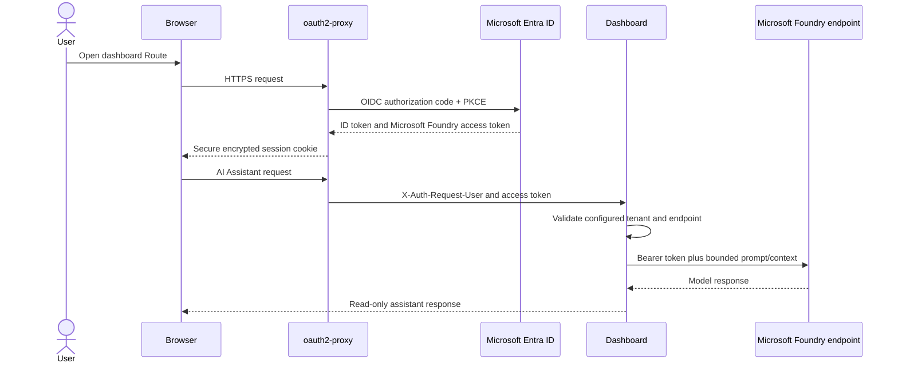

# Microsoft Foundry Authentication Guide for OpenShift

The Azure Arc Observability Dashboard AI Assistant is optional. In the OpenShift
deployment it uses the signed-in user's Microsoft Entra delegated token,
forwarded by oauth2-proxy. It does not use a Foundry API key and does not use
the central dashboard workload identity for model inference.

> [!IMPORTANT]
> The oauth2-proxy Entra tenant, delegated token tenant, configured Foundry
> tenant, and user/group RBAC assignments must form one valid authorization
> path. Complete the base OpenShift deployment first.

## Contents

1. [Authentication model](#1-authentication-model)
2. [Prerequisites](#2-prerequisites)
3. [Configure Entra delegated permission](#3-configure-entra-delegated-permission)
4. [Assign Foundry RBAC](#4-assign-foundry-rbac)
5. [Configure the chart and dashboard](#5-configure-the-chart-and-dashboard)
6. [Validate](#6-validate)
7. [Token lifecycle and multi-user behavior](#7-token-lifecycle-and-multi-user-behavior)
8. [Troubleshooting](#8-troubleshooting)
9. [Security and governance](#9-security-and-governance)
10. [Disable Foundry](#10-disable-foundry)

## 1. Authentication model



When `foundry.enabled` is set, the chart requests:

```text
openid
profile
email
offline_access
https://ai.azure.com/.default
```

oauth2-proxy validates the Entra identity token, stores the session in an
encrypted secure cookie, and forwards the delegated Cognitive Services access
token in `X-Auth-Request-Access-Token`. The dashboard holds it only in the
authenticated user's in-memory state.

### Identity separation

| Identity | Used for |
|---|---|
| Central dashboard workload identity | Shared Arc inventory, Resource Graph, Monitor, and Log Analytics |
| Signed-in Entra user | Foundry model inference and per-user dashboard session |
| Dashboard administrator | Saving shared Arc and Foundry configuration |

The workload identity's Azure roles do not grant users Foundry inference.
Each user or assigned Entra group needs appropriate Foundry data-plane RBAC.

## 2. Prerequisites

- A working OpenShift deployment through oauth2-proxy.
- A single-tenant Entra proxy web application, unless multitenant use has been
  explicitly reviewed.
- An Azure AI Foundry/Azure OpenAI resource and deployed model supported by the
  dashboard.
- An HTTPS endpoint ending in `.openai.azure.com` or
  `.services.ai.azure.com`.
- Permission to configure delegated API permissions and grant tenant consent.
- Permission to assign Azure RBAC on the Foundry resource.
- Browser and pod HTTPS access to Microsoft Entra ID and the Foundry endpoint.
- Organizational approval for prompts and bounded dashboard context to be sent
  to the selected model.

Record:

- Entra tenant ID;
- Foundry resource endpoint;
- model deployment name; and
- users or groups authorized for inference.

The deployment name is not necessarily the same as the base model family.

## 3. Configure Entra delegated permission

In the oauth2-proxy app registration:

1. Open **API permissions**.
2. Add delegated Microsoft Foundry access represented by
   `https://ai.azure.com/.default`.
3. Grant administrator consent when tenant policy requires it.
4. Keep the exact web redirect URI:

   ```text
   https://<route-host>/oauth2/callback
   ```

5. Require Enterprise Application assignment and assign only approved users or
   groups.

The chart leaves Foundry disabled by default. Enabling it adds the Microsoft
Foundry delegated scope while preserving the base OIDC scopes.

### Tenant considerations

The access token tenant must match the tenant configured for Foundry in the
dashboard. For cross-tenant scenarios, use an approved guest/B2B design in the
resource tenant and verify:

- the proxy application authorization endpoint;
- consent in the correct tenant;
- guest user/group assignment to the Enterprise Application; and
- Foundry RBAC for the guest object in the resource tenant.

Do not accept arbitrary issuer tenants merely to make cross-tenant access
work.

## 4. Assign Foundry RBAC

Assign `Cognitive Services OpenAI User` at the narrowest Foundry resource scope
to approved users or Entra groups. This role permits data-plane model inference
without resource management.

Typical separation:

| Principal | Role | Scope |
|---|---|---|
| Approved dashboard users/group | `Cognitive Services OpenAI User` | Specific Foundry/Azure OpenAI resource |
| Foundry platform administrators | Organization-defined management role | Resource group or resource |
| Dashboard central workload identity | No Foundry role required | None |

The AI Assistant should not require `Owner`, `Contributor`, or API keys.
Allow time for Azure RBAC propagation before testing.

## 5. Configure the chart and dashboard

### 5.1 Confirm chart scopes

Enable Foundry in the production values:

```yaml
foundry:
  enabled: true
  scopes:
    - https://ai.azure.com/.default
```

After changing scopes, upgrade the release:

```bash
helm upgrade arc-dashboard . \
  -n arc-dashboard \
  -f values-production.yaml \
  --wait --timeout 10m
```

Existing users must sign in again to receive a token with the new scope. If
necessary, rotate only the cookie secret through the external secret manager
to invalidate every proxy session.

### 5.2 Save Foundry configuration

Use an identity listed in `dashboard.administratorUsers`:

1. Sign in through the OpenShift Route.
2. Open **AI Assistant**.
3. Enter the Entra tenant ID used by the proxy authorization flow.
4. Confirm authentication. In trusted-proxy mode, the dashboard validates the
   delegated token already attached to the session; it does not launch an Azure
   CLI device-code flow.
5. Enter the approved Foundry resource endpoint.
6. Enter the model deployment name.
7. Save the configuration.
8. Run a simple read-only question.

The shared endpoint, deployment name, and tenant are encrypted in
`dashboard.config.dat` on the PVC. User access tokens are not written to that
configuration file.

## 6. Validate

### 6.1 Validate user authorization

Test at least:

- an assigned Enterprise Application user with Foundry RBAC;
- an assigned user without Foundry RBAC;
- an unassigned Enterprise Application user; and
- an administrator identity.

Expected results:

| Test | Expected result |
|---|---|
| Assigned user plus Foundry role | Dashboard and AI inference succeed |
| Assigned user without Foundry role | Dashboard opens; Foundry returns authorization failure |
| User not assigned to Enterprise Application | Entra blocks proxy sign-in |
| Non-administrator assigned user | Dashboard read access succeeds; shared AI configuration changes are blocked |

### 6.2 Validate without exposing tokens

Use oauth2-proxy and dashboard logs only for status codes, issuer/audience
errors, and correlation IDs. Never print, decode in shared terminals, or paste
complete access tokens into logs or tickets.

Verify:

- Route and callback host match.
- oauth2-proxy sign-in completes without a loop.
- The dashboard reports Foundry authentication as complete.
- The configured endpoint is HTTPS and on an accepted Azure hostname.
- A basic prompt returns a response.
- The same user loses inference after Foundry RBAC is removed and propagation
  completes.

## 7. Token lifecycle and multi-user behavior

oauth2-proxy maintains an encrypted browser session cookie. `cookieRefresh`
defaults to one hour and `cookieExpire` to eight hours. Entra Conditional
Access, token revocation, secret rotation, and sign-out can shorten effective
session life.

The dashboard derives a per-user state directory from the normalized
`X-Auth-Request-User` value. The delegated access token is held in memory for
that authenticated user and refreshed when oauth2-proxy refreshes the session.
Dashboard logout clears that user's dashboard state but does not delete the
central Arc scope or sign out other users.

Because oauth2-proxy uses cookie-backed sessions:

- avoid unnecessary large group claims;
- use Enterprise Application assignment for coarse authorization;
- keep cookie encryption keys consistent for the running release; and
- expect all sessions to end when the cookie secret rotates.

## 8. Troubleshooting

### Dashboard says no delegated Foundry token is present

- Confirm `foundry.enabled` is `true` and the rendered provider scope includes
  `https://ai.azure.com/.default`, matching the dashboard runtime.
- Confirm the rendered alpha configuration injects
  `X-Auth-Request-User` from `preferred_username` and
  `X-Auth-Request-Access-Token` from `access_token`.
- Sign out and back in after changing scopes or consent.
- Confirm the proxy image version supports the configured flags.

### Entra returns consent or invalid-scope errors

- Confirm Azure Cognitive Services `user_impersonation` is added as a
  **delegated**, not application, permission.
- Grant administrator consent when required.
- Confirm the authorization request uses the tenant configured by
  `azureIdentity.tenantId`.
- Check tenant Conditional Access and user-consent policy.

### Foundry returns HTTP 401

- Confirm the token tenant matches the dashboard Foundry tenant.
- Confirm the scope/audience is Azure Cognitive Services.
- Sign in again to obtain a fresh token.
- Verify system time and OpenShift node time synchronization.

### Foundry returns HTTP 403

- Assign `Cognitive Services OpenAI User` to the user or group on the exact
  resource.
- Allow for RBAC propagation.
- Check that a guest identity's object in the resource tenant received the
  role.
- Confirm the selected endpoint belongs to the authorized resource.

### Endpoint is rejected

Use the resource endpoint, not a portal URL. Accepted hosts end in:

```text
.openai.azure.com
.services.ai.azure.com
```

Use HTTPS and enter the deployment name separately.

### Login loops or cookies exceed router limits

- Remove optional Entra group claims when they make the token/cookie too large.
- Require Enterprise Application assignment instead of carrying all groups.
- Confirm HSTS, secure cookies, Route host, proxy redirect URI, and router
  forwarding headers.
- Confirm every request reaches the same singleton proxy pod.

### Only administrators can configure Foundry

This is expected. Add the correct normalized Entra identity to
`dashboard.administratorUsers`, upgrade the release, and sign in again. Do not
grant Azure owner roles merely to make a user a dashboard administrator.

### Private endpoint cannot be reached

- Add the required private DNS zone and resolver path to OpenShift.
- Add approved private endpoint or egress proxy CIDRs to NetworkPolicy.
- Confirm the pod resolves the endpoint to the expected private IP.
- Validate TLS inspection policy and certificate trust without disabling
  certificate verification.

## 9. Security and governance

- No Foundry API key is stored or supported by this chart.
- Use delegated user RBAC so Foundry access follows the signed-in principal.
- Apply Conditional Access, MFA, sign-in risk, location, and device policy as
  required.
- Review model deployment region, data handling, content filtering, abuse
  monitoring, quota, and retention settings.
- Treat prompts and bounded dashboard context as organizational data sent to
  the configured Foundry service.
- Keep the dashboard's server-side AI tools read-only and bounded.
- Do not grant the model or user identity Azure management roles solely for
  chat.
- Audit Entra sign-ins, Foundry data-plane activity, role assignments, and
  Enterprise Application assignments.
- Redact prompts, responses, resource names, correlation data, and tokens
  before sharing diagnostics.
- Rotate the proxy client secret according to policy and immediately after
  suspected disclosure.

## 10. Disable Foundry

1. Disable or clear AI Assistant configuration through an administrator
   session according to application policy.
2. Set `foundry.enabled: false`.
3. Run `helm upgrade`.
4. Require users to sign in again or rotate the cookie secret.
5. Remove `Cognitive Services OpenAI User` assignments that are no longer
   required.
6. Remove delegated API consent from the proxy application if no other
   workload uses it.

Disabling Foundry does not affect the central workload identity used for Arc
inventory and monitoring.
