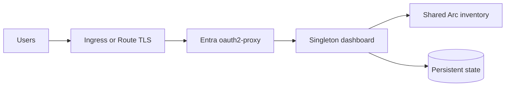

# Azure Arc Observability Dashboard - Kubernetes deployments

The Kubernetes packages deploy the same container image with platform-specific exposure,
identity, and storage adapters:

| Platform | Package | External endpoint |
|---|---|---|
| Azure Kubernetes Service | [AKS](AKS/README.md) | TLS Ingress through oauth2-proxy |
| Red Hat OpenShift | [OpenShift](OpenShift/README.md) | TLS Route through oauth2-proxy |

Both packages enforce one dashboard pod and `Recreate` deployment strategy. Do not add an
HPA, KEDA scaler, canary, blue/green overlap, or second release for the same Azure scope.
Duplicate instances produce duplicate Azure Resource Graph and Log Analytics queries.

Build the image from [`../docker`](../docker/README.md), publish it to an approved registry,
and set the chart's image repository and immutable tag or digest. Each platform README
documents its required identity, secret, TLS, storage, and network configuration.

> [!IMPORTANT]
> The dashboard container must never be exposed directly. Only the authentication proxy
> Service is routable. Health probes reach the dashboard over pod localhost.
