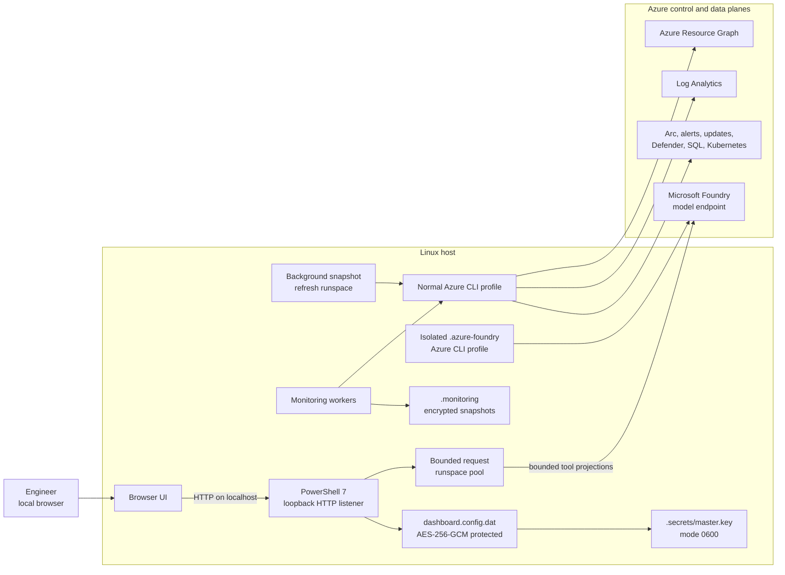
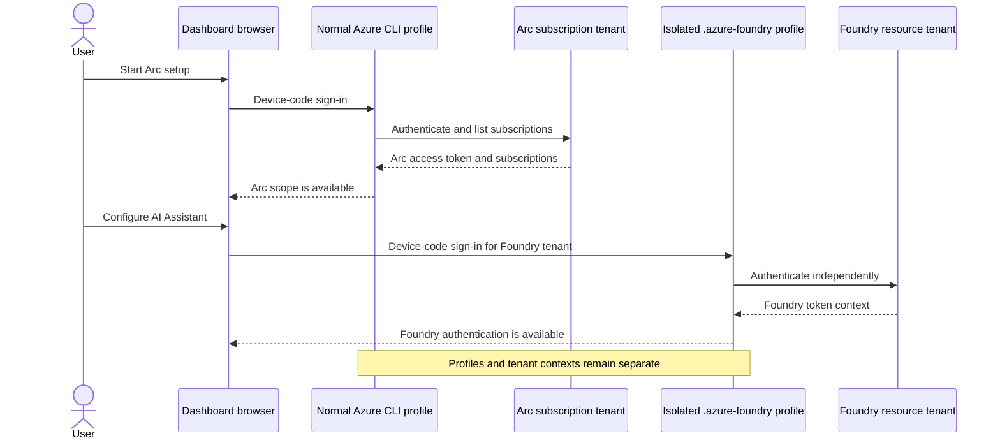
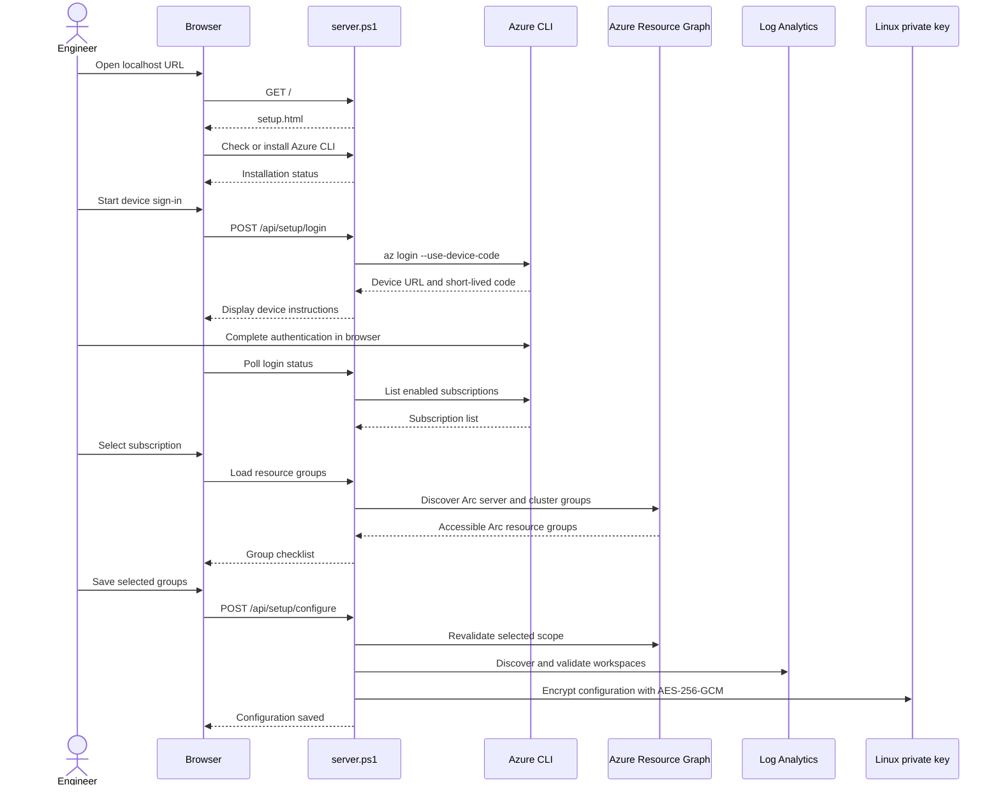
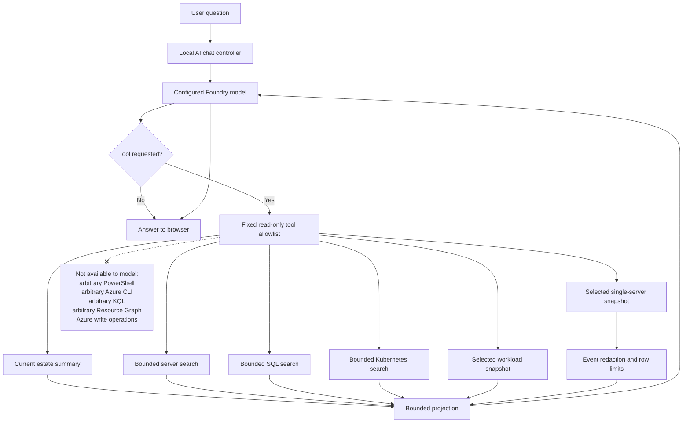
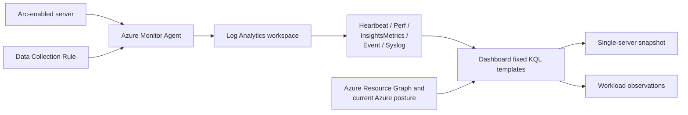
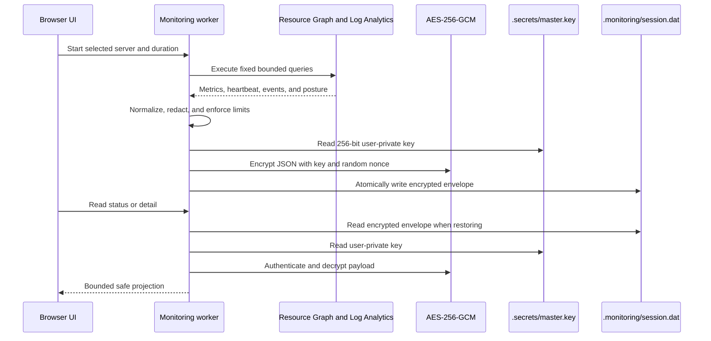
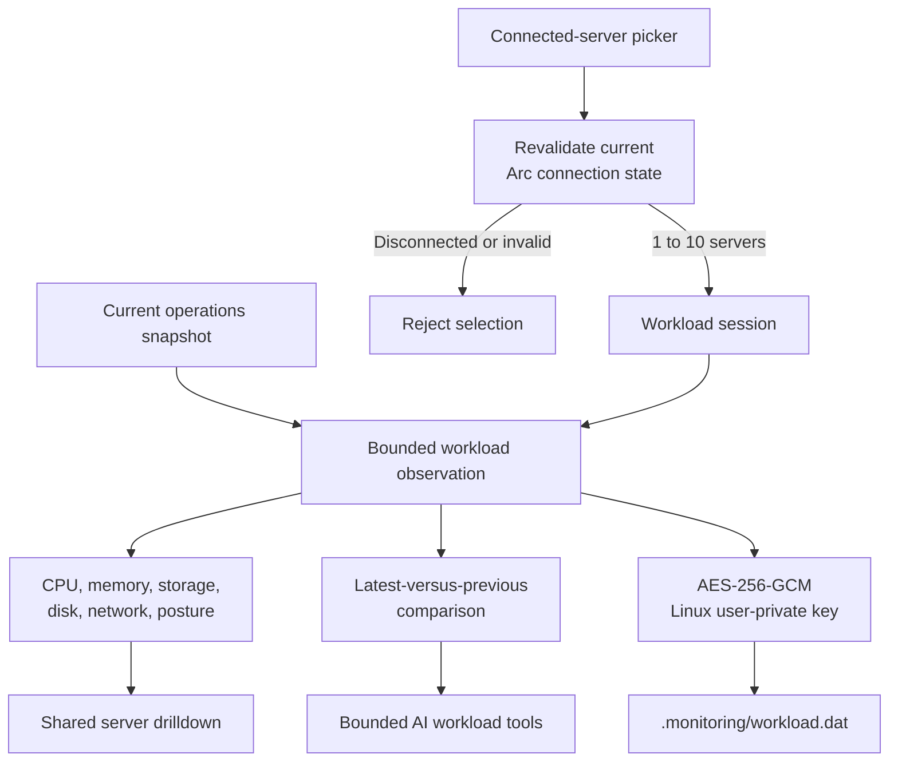
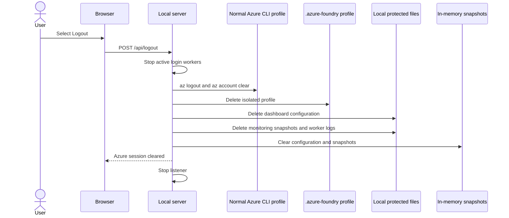

# Azure Arc Observability Dashboard Configuration and Operations Guide for Linux

This guide explains how to deploy, configure, secure, validate, and operate the
standalone Azure Arc Observability Dashboard on Ubuntu- and Fedora/RHEL-family Linux. It is intended for engineers who
administer Azure Arc-enabled servers, Arc-enabled Kubernetes, Azure Monitor,
Log Analytics, and the optional Microsoft Foundry integration.

The guide describes the implementation in this `LinuxServer` deployment package. It does not
apply changes to Azure resources and it does not cover the enterprise variant.

> [!IMPORTANT]
> The dashboard is a read-only operational console. It can inventory and analyze
> resources the signed-in identity can read, but it does not remediate, patch,
> restart, deploy to, or otherwise modify Azure resources.

## Contents

1. [Architecture and trust boundaries](#1-architecture-and-trust-boundaries)
2. [Plan identities, scope, and permissions](#2-plan-identities-scope-and-permissions)
3. [Prepare the Linux host](#3-prepare-the-linux-host)
4. [Copy or deploy the dashboard](#4-copy-or-deploy-the-dashboard)
5. [Start the dashboard](#5-start-the-dashboard)
6. [Complete first-run Azure setup](#6-complete-first-run-azure-setup)
7. [Understand the initial snapshot](#7-understand-the-initial-snapshot)
8. [Configure Microsoft Foundry](#8-configure-microsoft-foundry)
9. [Configure monitoring telemetry](#9-configure-monitoring-telemetry)
10. [Use single-server monitoring](#10-use-single-server-monitoring)
11. [Use workload monitoring](#11-use-workload-monitoring)
12. [Understand local storage and encryption](#12-understand-local-storage-and-encryption)
13. [Operate, reconfigure, migrate, and remove](#13-operate-reconfigure-migrate-and-remove)
14. [Troubleshooting](#14-troubleshooting)
15. [Authentication and security FAQ](#15-authentication-and-security-faq)
16. [Post-configuration validation checklist](#16-post-configuration-validation-checklist)
17. [Microsoft references](#17-microsoft-references)

## 1. Architecture and trust boundaries

The standalone dashboard is a self-contained Linux application:

- PowerShell 7 hosts a custom HTTP listener and bounded runspace pools.
- The listener binds only to the local loopback interface.
- HTML, CSS, and JavaScript are served from the local application directory.
- Azure CLI supplies Microsoft Entra authentication.
- Azure Resource Graph supplies Arc inventory and resource posture.
- Log Analytics supplies available monitoring telemetry.
- The optional AI Assistant calls a configured Microsoft Foundry model.
- There is no frontend framework, external web server, or local database.



### Runtime request model

The server separates slow Azure collection from normal page requests:

1. A dedicated background runspace queries Azure and builds complete snapshots.
2. A complete operations, SQL, or Kubernetes snapshot is published atomically.
3. Browser requests read a completed snapshot, never a partially built one.
4. Paginated APIs return bounded pages rather than the complete inventory.
5. Detail APIs fetch the selected server, SQL instance, or cluster on demand.
6. A configuration generation prevents an old refresh from publishing data
   after the scope has changed or the user has logged out.

The default estate refresh interval is 300 seconds. Existing pages remain
responsive while a later refresh is being built.

```mermaid
stateDiagram-v2
    [*] --> Unconfigured
    Unconfigured --> Configured: Save subscription and resource groups
    Configured --> Building: First request or refresh worker
    Building --> Published: Complete snapshot built
    Published --> Building: Refresh interval reached
    Building --> Published: Atomic replacement
    Building --> Published: Failed refresh discarded;<br/>previous snapshot retained
    Published --> Building: Scope reconfiguration
    Configured --> Unconfigured: Logout
    Published --> Unconfigured: Logout
```



### Loopback and browser boundary

The listener binds to `IPAddress.Loopback`; it is not bound to a LAN interface.
The application URL is either `http://localhost:<port>/` or
`http://127.0.0.1:<port>/`. State-changing API requests that include an
`Origin` header are accepted only from one of those two origins on the active
port. Every API request must also present a random per-launch HttpOnly,
SameSite session cookie issued with dashboard pages. This strengthens
protection against cross-site browser requests that omit the `Origin` header.
It is not OS-user authentication: another local process that can load a
dashboard page can receive a cookie. Use a trusted dedicated host account and
normal Linux user/process isolation.

Loopback-only binding means:

- Another computer cannot browse directly to the dashboard.
- No inbound Internet exposure or web-server certificate is required.
- A remote user must use an approved Linux desktop session or a controlled SSH
  local-forwarding workflow; do not expose the listener through a public proxy.
- Malware or an untrusted process already running as the same Linux user is
  outside this network boundary and must be addressed through endpoint security.

## 2. Plan identities, scope, and permissions

### 2.1 Decide which identities will be used

The dashboard can use one identity for Arc and another for Foundry:

| Identity context | Local token profile | Used for |
|---|---|---|
| Arc operations | Normal Azure CLI profile | Subscription discovery, Resource Graph, Log Analytics, Arc inventory, alerts, updates, Defender, SQL, and Kubernetes |
| Microsoft Foundry | `.azure-foundry/` in the deployment directory | Obtain a Foundry data-plane token and call the selected model deployment |

The identities may be:

- The same Microsoft Entra user in the same tenant.
- Guest representations of the same person in different tenants.
- Two different approved users.
- An Arc identity in one tenant and a Foundry identity in another tenant.

Using separate profiles prevents Foundry sign-in from silently replacing the
Azure CLI context used to collect Arc data.



### 2.2 Choose the dashboard scope

The standalone dashboard stores:

- One Azure subscription ID.
- One or more selected resource groups.
- Automatically discovered Log Analytics workspaces.
- Optional Foundry tenant, resource endpoint, and deployment name.

Select every resource group containing Arc resources that should appear. A
resource group may contain:

- Arc-enabled servers.
- Arc-enabled Kubernetes clusters.
- Both resource types.

The setup service revalidates selected groups against live Resource Graph data
before saving them. A resource group that does not contain accessible Arc
servers or clusters cannot be persisted as dashboard scope.

### 2.3 Assign Arc and Azure Monitor permissions

Start with least privilege and assign roles at the narrowest practical scope.
The exact permission set depends on which dashboard features are expected to
return data.

| Data or feature | Typical permission requirement |
|---|---|
| Arc server and Kubernetes inventory through Resource Graph | `Reader` at the selected subscription or all selected resource groups |
| Log Analytics queries | `Log Analytics Reader` on each workspace, or equivalent query permissions supplied by a broader role |
| Azure Monitor resource details | `Monitoring Reader` or equivalent read permissions where required |
| Defender recommendations and security posture | Read access to Microsoft Defender for Cloud recommendations at the applicable scope |
| Arc-enabled SQL details | Read permissions for the applicable Azure Arc-enabled SQL resources |
| Kubernetes extensions | Read access to `Microsoft.Kubernetes/connectedClusters` and `Microsoft.KubernetesConfiguration/extensions` |
| Patch and update posture | Read access to Arc machine patch-assessment and update data |
| Model inference | `Cognitive Services OpenAI User` on the Foundry resource |

> [!TIP]
> `Reader` can be sufficient for Azure Resource Graph inventory but does not
> guarantee Log Analytics data-plane query access. If servers appear while CPU,
> memory, disk, network, heartbeat, or events are unavailable, verify workspace
> permissions and telemetry ingestion separately.

To create role assignments, the administrator performing the assignment
typically needs `Owner` or `User Access Administrator` at the assignment scope.
The dashboard itself does not need either role.

### 2.4 Verify access before deployment

Use a normal shell:

```powershell
az login --use-device-code
az account list --output table
az account set --subscription "<subscription-name-or-ID>"
az account show --output table
```

Confirm that:

- The required subscription appears and is enabled.
- The active tenant is the tenant that contains or delegates access to the
  subscription.
- The identity can read the selected Arc resource groups.
- The identity can query each required Log Analytics workspace.

If the subscription does not appear, device authentication may have succeeded
while the identity still lacks subscription access.

## 3. Prepare the Linux host

### Required software

- A supported Ubuntu, Fedora, RHEL, Rocky Linux, AlmaLinux, or compatible host.
- PowerShell 7.4 or later, available as `pwsh`.
- A current browser on the same computer.
- Azure CLI. The setup page displays distribution-specific installation links
  if it is absent; it does not invoke `sudo` or change package repositories.
- `xdg-open` when automatic browser launch is desired. It is not required when
  `-NoBrowser` is used.
- Network access to Microsoft Entra, Azure management endpoints, Resource
  Graph, Log Analytics, and optionally the Foundry resource endpoint.

Verify PowerShell 7.4 or later:

```powershell
pwsh --version
```

Verify Azure CLI if already installed:

```powershell
az version
```

### Install PowerShell and Azure CLI

Use the official Microsoft repository instructions for the host distribution:

- [Install PowerShell on Ubuntu](https://learn.microsoft.com/powershell/scripting/install/install-ubuntu)
- [Install PowerShell on Red Hat Enterprise Linux](https://learn.microsoft.com/powershell/scripting/install/install-rhel)
- [Install Azure CLI with APT](https://learn.microsoft.com/cli/azure/install-azure-cli-linux?pivots=apt)
- [Install Azure CLI with DNF](https://learn.microsoft.com/cli/azure/install-azure-cli-linux?pivots=dnf)

Install packages from an administrative shell according to organizational
policy. The dashboard web process intentionally never runs `sudo`.

### Network considerations

Allow the Linux host to reach the approved Azure endpoints through the
organization's proxy and firewall controls. If a Foundry resource uses a
private endpoint or selected-network access, the host must have the approved
VNet, VPN, ExpressRoute, DNS, and routing path to that resource.

The dashboard does not bypass private-network controls. A Foundry model that
works from an Azure-hosted environment may remain unreachable from an
unconnected host.

### Linux user and filesystem selection

Choose a dedicated or approved Linux user account to operate the dashboard.
That user must own and have write access to the deployment directory. The
dashboard creates `.secrets/` with mode `0700` and a 32-byte AES master key
with mode `0600`.

Do not run the application alternately as `root` and a standard account.
Different users may be unable to access each other's configuration, key, Azure
CLI profile, or monitoring files. Keep the deployment directory on a local or
trusted filesystem that honors Unix ownership and permission bits.

## 4. Copy or deploy the dashboard

Copy the complete `LinuxServer` package to a stable local path such as
`/opt/arc-dashboard` or `$HOME/arc-dashboard`. Do not copy only the HTML files;
the PowerShell modules and startup scripts are required.

The standalone directory must include at least:

```text
LinuxServer/
  Launcher.sh
  Start-Dashboard.ps1
  server.ps1
  ArcDashboard.Security.psm1
  ArcDashboard.Core.psm1
  ArcDashboard.AI.psm1
  ArcDashboard.Monitoring.psm1
  ArcDashboard.WorkloadMonitoring.psm1
  Azure-Login.ps1
  Install-AzureCli.ps1
  *.html
```

### Do not migrate machine-bound state

When moving the application to another computer or Linux user, do not rely
on these copied items:

```text
dashboard.config.dat
.secrets/
.azure-foundry/
.monitoring/
```

`dashboard.config.dat` and the monitoring snapshots require the key in
`.secrets/master.key`. Copying that key broadens access to every encrypted
dashboard file, so runtime state must not be included in a reusable package. The
`.azure-foundry` directory contains Azure CLI authentication state and should
never be distributed, committed, or treated as deployable configuration.

For a clean migration:

1. Copy the application source files.
2. Remove old user-specific state from the destination copy if present.
3. Assign the deployment directory to the intended Linux user and restrict
   access according to organizational policy.
4. Start the dashboard as that Linux user.
5. Repeat Arc device authentication and scope setup.
6. Repeat Foundry device authentication and AI configuration if required.

## 5. Start the dashboard

### Preferred interactive startup

Open a shell and change to the Linux deployment directory:

```bash
cd /opt/arc-dashboard
chmod u+x ./Launcher.sh
./Launcher.sh
```

The launcher verifies that `pwsh` exists. `Start-Dashboard.ps1` discovers three
currently available high-numbered loopback ports and prompts for one. It then
starts the local server and opens the browser.

### Direct or scripted startup

To use the same interactive port selector:

```bash
pwsh -NoProfile -File ./Start-Dashboard.ps1
```

To request a fixed available port:

```bash
pwsh -NoProfile -File ./Start-Dashboard.ps1 -Port 8766
```

The port must be between 1024 and 65535 and must not already be in use. If the
port is occupied, run without `-Port` and choose one of the offered ports.

To start without opening a browser:

```bash
pwsh -NoProfile -File ./Start-Dashboard.ps1 -Port 8766 -NoBrowser
```

Then browse locally to:

```text
http://localhost:8766/
```

Keep the launcher terminal open. Press `Ctrl+C` to stop the local dashboard
process. Run the first release interactively; a systemd service is not
included because device-code setup and browser-local operation are interactive.

## 6. Complete first-run Azure setup

If no readable configuration exists, `/` opens `setup.html`. After setup,
`/` opens the main dashboard.



### Step 1: Azure CLI

The page checks whether Azure CLI is available.

- If installed, confirm that the displayed executable and version are
  expected.
- If missing, select **Show install steps**.
- Follow the detected APT or DNF guidance in a separate administrative shell.
- Refresh the setup page after `az` is available on `PATH`.

If enterprise software policy blocks installation, install the signed Azure
CLI package through the organization's approved software-distribution method.

### Step 2: Sign in to Azure

1. Leave **Tenant/directory ID** blank to use the user's default directory, or
   enter the target tenant GUID.
2. Select **Start device sign-in**.
3. Open the displayed Microsoft device-sign-in URL.
4. Enter the short-lived code shown by the dashboard.
5. Authenticate using the Arc data identity.
6. Return to the setup page and wait for subscriptions to load.

Device-code authentication is appropriate because the PowerShell server has no
embedded interactive login browser and does not store a username or password.
The code is short-lived and must be completed directly with Microsoft Entra.

If the page briefly says that no subscriptions are available, allow several
seconds for the Azure CLI account cache to populate. The UI polls login status
and retries subscription discovery.

### Step 3: Select subscription

Choose the subscription that contains the Arc resources. Only enabled
subscriptions returned by the authenticated Azure CLI profile are shown.

Select **Load Resource Groups**.

If the intended subscription is missing:

1. Confirm the tenant ID.
2. Confirm that the signed-in identity has a role assignment on the
   subscription or target resource groups.
3. Confirm that the subscription is enabled.
4. Sign out and repeat device authentication with the correct identity.

### Step 4: Choose Arc resource groups

The page lists accessible resource groups containing Arc-enabled servers,
Arc-enabled Kubernetes clusters, or both.

1. Use the filter to narrow the list if necessary.
2. Select each group that should be in dashboard scope.
3. Use **Select all** only when every discovered group is intended.
4. Save the configuration.
5. Wait while the dashboard revalidates scope and discovers monitoring
   workspaces.

At least one group is required.

### Workspace discovery

The setup does not ask the user to type workspace IDs. It discovers candidate
Log Analytics workspaces from Data Collection Rule destinations associated
with the selected scope. If needed, it falls back to subscription-level DCR
discovery. Candidate workspaces are validated with a harmless Log Analytics
query before they are saved.

The setup result reports the count of selected resource groups and discovered
monitoring workspaces. Zero workspaces does not prevent Arc inventory from
loading, but historical and performance telemetry will be unavailable.

## 7. Understand the initial snapshot

The first load may take from roughly one minute to several minutes. Duration
depends on:

- Arc resource count.
- Number and size of selected resource groups.
- Resource Graph pagination.
- Number of discovered workspaces.
- Log Analytics query latency and ingestion availability.
- Azure throttling and network conditions.

Large inventories are intentionally read through complete paginated queries.
If a safety ceiling is reached or a refresh fails, the application does not
publish an incomplete snapshot.

Subsequent page loads are usually much faster because they use the latest
in-memory snapshot. A background refresh builds later generations without
blocking reads of the current generation.

### Verify the initial result

Check:

- **Summary** for the total Arc server and Kubernetes counts.
- **Arc-enabled Servers** for pagination and search.
- **Kubernetes** for connected clusters.
- **SQL** for Arc-enabled SQL inventory.
- **Global** for the geographic rollup.
- **Platforms** and **Deployment** for classifications and extension posture.

If only a subset appears, verify the saved resource-group scope before
assuming an application pagination issue. The inventory APIs follow Resource
Graph skip tokens and return bounded pages with a total count.

## 8. Configure Microsoft Foundry

Microsoft Foundry is optional. Arc inventory and non-AI dashboard pages can be
used without it.

For detailed Foundry resource provisioning, model deployment, RBAC commands,
cost planning, and playground testing, see
[Standalone Microsoft Foundry Setup and Usage Guide](standalone-foundry-setup.md).

### 8.1 Foundry prerequisites

Prepare:

- A Foundry or Azure OpenAI resource.
- A deployed chat-completions-compatible model that supports tool calling.
- The tenant GUID containing the Foundry resource.
- The resource endpoint.
- The exact model deployment name.
- `Cognitive Services OpenAI User` assigned to the identity that will complete
  Foundry device authentication.

Management roles such as `Contributor` do not necessarily grant model
inference. Confirm the data-plane role explicitly.

### 8.2 Use the correct endpoint

Accepted resource endpoint forms include:

```text
https://<resource-name>.openai.azure.com
https://<resource-name>.services.ai.azure.com
https://<resource-name>.openai.azure.com/openai/v1
```

Do not enter:

- A project-management URL containing `/api/projects/`.
- A URL ending in `/chat/completions` or `/responses`.
- A URL with query parameters or fragments.
- An API key or connection string.
- A deployment display name that differs from the exact deployment name.

The dashboard normalizes the base URL and calls:

```text
/openai/v1/chat/completions
```

### 8.3 Complete Foundry sign-in

1. Open **AI Assistant**.
2. Enter the **Foundry tenant ID**.
3. Select **Sign in to Foundry tenant**.
4. Complete the displayed Microsoft device-code flow.
5. Use the identity that has `Cognitive Services OpenAI User` on the resource.
6. Wait until authentication reports success.
7. Enter the **Foundry resource endpoint**.
8. Enter the exact **Model deployment name**.
9. Select **Save AI configuration**.

Foundry sign-in uses `AZURE_CONFIG_DIR` to isolate its Azure CLI state under
`.azure-foundry`. It does not change the normal Arc Azure CLI profile.

### 8.4 Understand the AI security boundary



The model can request only implemented, allowlisted, read-only tools. It cannot
construct arbitrary KQL or invoke PowerShell, Azure CLI, Resource Graph, or
Azure write operations.

Search projections generally return at most 25 rows and omit Azure resource
IDs and workspace names. Monitoring event text is cleaned, capped, and redacts
credential-shaped values such as bearer tokens, passwords, secrets, API keys,
and connection strings.

The model can still receive operationally sensitive data, including resource
names, resource groups, health, lifecycle, versions, posture, metrics, and
redacted event content. Select a Foundry deployment geography and access model
consistent with organizational data-handling requirements.

Conversation history remains in the current browser tab; it is not persisted
by the dashboard.

## 9. Configure monitoring telemetry

Arc connectivity alone does not provide every metric. The dashboard queries
data that Azure Monitor has already collected.

### 9.1 Required telemetry path



For each monitored server, verify:

1. Azure Monitor Agent is installed and healthy.
2. A Data Collection Rule is associated with the server.
3. The DCR sends required data to a workspace discoverable by the dashboard.
4. The dashboard identity can query that workspace.
5. Data is arriving in the expected Log Analytics tables.
6. Required performance counters are explicitly included in the DCR.

### 9.2 Suggested data coverage

Configure only the data approved and required by the organization.

| Dashboard signal | Typical source |
|---|---|
| Connectivity and last heartbeat | `Heartbeat` |
| CPU and memory | `Perf` or corresponding `InsightsMetrics` |
| Disk capacity/free space | `Perf` or corresponding `InsightsMetrics` |
| Disk read/write IOPS | Logical Disk performance counters |
| Disk throughput | Logical Disk read/write bytes per second |
| Disk latency | Logical Disk average seconds per read/write |
| Disk queue length | Logical Disk current/average queue counter |
| Network throughput | Network performance counters or corresponding insights metrics |
| Windows events | `Event` |
| Linux logs | `Syslog` |
| Alerts, updates, reboot, and lifecycle | Current Azure resource and operational posture |

The implementation uses fixed query templates and does not accept KQL from the
browser or model.

### 9.3 Disk I/O interpretation

The dashboard avoids obvious double counting by:

- Scoping `Perf` disk metrics to Logical Disk.
- Excluding `_Total` instances.
- Avoiding simultaneous PhysicalDisk and LogicalDisk aggregation.
- Averaging samples per instance, aggregating instances, and then averaging
  time bins.

Missing disk counters are shown as unavailable rather than zero. `N/A` means
that a supported value was not available in the queried window; it does not
prove the machine performed no I/O.

### 9.4 Validate ingestion

In the Log Analytics workspace, use approved queries to confirm recent data.
For example:

```kusto
Heartbeat
| where TimeGenerated > ago(30m)
| summarize LastHeartbeat=max(TimeGenerated) by _ResourceId
| order by LastHeartbeat desc
```

Inspect available performance counter names before updating a DCR:

```kusto
Perf
| where TimeGenerated > ago(30m)
| summarize Samples=count() by ObjectName, CounterName
| order by ObjectName asc, CounterName asc
```

For Linux and Windows logs:

```kusto
Syslog
| where TimeGenerated > ago(30m)
| take 10
```

```kusto
Event
| where TimeGenerated > ago(30m)
| take 10
```

These are diagnostic examples for engineers. The dashboard itself continues
to use only its fixed allowlisted templates.

## 10. Use single-server monitoring

Single-server monitoring provides the deeper telemetry view.

### Start a session

1. Open **AI Assistant**, or choose **Monitor with Arc AI** from an Arc server
   detail.
2. In the single-server selector, enter part of a name and choose **Find**.
3. To list all currently connected servers, leave the search box blank and
   choose **Find**.
4. Select one connected server.
5. Choose 30 minutes, 1 hour, 2 hours, 4 hours, or 8 hours.
6. Start monitoring.

Only one single-server session exists at a time. Starting a replacement
session replaces the previous snapshot.

### Data collected

Depending on availability and permissions, the snapshot can include:

- CPU and memory.
- Disk capacity.
- Read/write IOPS and throughput.
- Read/write latency and queue length.
- Network throughput.
- Heartbeat and connectivity.
- Windows Event or Syslog records.
- Alerts, update posture, reboot state, and Arc observations.

The monitoring dataset is bounded to:

- A maximum 8-hour window.
- 12,000 metric rows.
- 1,000 event rows.
- 480 observations.

The background worker refreshes an active session periodically. **Collect
now** requests an immediate collection without changing the configured
duration.

### Session controls

- **Stop** ends recurring collection but retains the encrypted snapshot.
- **Delete snapshot** permanently removes the stored single-server dataset.
- Scope reconfiguration or **Logout** also deletes the snapshot.
- A completed snapshot is retained for no more than 24 hours.

### Single-server encrypted flow



## 11. Use workload monitoring

Workload monitoring compares a related group of 1 to 10 currently connected
Arc servers.

### Start a workload session

1. Open **Workload monitoring** in **AI Assistant**.
2. Enter part of a server name and choose **Find**.
3. To list all connected servers, leave the field blank and choose **Find**.
4. Check one or more results.
5. Select **Add checked servers**.
6. Repeat until the intended 1 to 10 servers are selected.
7. Choose 30 minutes, 1 hour, 2 hours, 4 hours, or 8 hours.
8. Select **Start workload monitoring**.

Search results include only servers that are connected in the current
operations snapshot. The server revalidates connection state when selections
are added and when a session is created. A server that disconnected after
search may therefore be rejected.

### Data collected

Workload observations contain summary data for:

- Logical CPU capacity and capacity-weighted CPU utilization.
- Installed memory and capacity-weighted memory utilization.
- Reported storage capacity and estimated percentage used.
- Disk IOPS and throughput.
- Network throughput.
- Heartbeat and Arc connection status.
- Alerts, updates, reboot state, lifecycle, and health.

The latest comparison shows change from the previous observation. Green
up-arrows indicate an increase; red down-arrows indicate a decrease. An
increase is not always good: rising CPU, memory, disk I/O, network, or storage
use must be interpreted in workload context.

Workload monitoring stores summary telemetry only. It does not collect Windows
Event or Syslog rows. Open the shared server drilldown or start single-server
monitoring when deep investigation is needed.



### Workload controls

- **Collect now** requests an immediate summary observation.
- **Stop** ends recurring collection and leaves the snapshot available.
- Remove buttons remain available after a session is stopped.
- **Delete snapshot** permanently removes the workload dataset.
- The completed dataset is retained for no more than 24 hours.
- Dashboard scope reconfiguration and **Logout** delete it.

## 12. Understand local storage and encryption

### Local files

| Path | Purpose | Protection and lifecycle |
|---|---|---|
| `$HOME/.azure/` | Shared normal Azure CLI profile used for Arc | Azure CLI-managed tokens; shared with other Azure CLI tools and cleared by dashboard Logout |
| `.secrets/master.key` | 32-byte local encryption key | Created with mode `0600` under a mode-`0700` directory; removed by Logout |
| `dashboard.config.dat` | Subscription, resource groups, workspaces, optional Foundry tenant/endpoint/deployment | AES-256-GCM authenticated encryption; mode `0600`; removed by Logout |
| `.azure-foundry/` | Isolated Azure CLI state for Foundry | Azure CLI-managed tokens under a mode-`0700` directory; removed by Logout |
| `.monitoring/session.dat` | Single-server monitoring snapshot | AES-256-GCM authenticated encryption; mode `0600`; deleted on request, reconfiguration, expiry, or Logout |
| `.monitoring/workload.dat` | Workload monitoring snapshot | Same encrypted envelope model; deleted on request, reconfiguration, expiry, or Logout |
| `/tmp/ArcDashboard-<random-suffix>/` | Short-lived setup/login worker output | Atomically created mode-`0700` directory containing mode-`0600` logs; cleaned on Logout or shutdown |

Normal estate inventory snapshots remain in memory and are not persisted as a
local inventory database.

### What the Linux key model means

The Linux package uses a randomly generated local key rather than Windows
DPAPI. Unix directory ownership and permission bits protect that key. The
dashboard resets `.secrets/` to mode `0700` and `master.key` to mode `0600`
whenever the key is used.

- Any user or process that can read `master.key` can decrypt the local
  dashboard configuration and monitoring files.
- Do not copy the key into source control, deployment archives, backups with
  broader readership, or another user's home directory.
- Losing the key makes the encrypted files unrecoverable.
- Run the package as one dedicated or approved non-root account.
- Use full-disk encryption, endpoint protection, SELinux/AppArmor policy, and
  restrictive filesystem ownership as additional controls.
- Avoid filesystems that ignore Unix modes or expose the directory through
  permissive network shares.

### Monitoring encryption envelope

For configuration and monitoring data, the application:

1. Creates one random 32-byte key for the local deployment when needed.
2. Restricts the key file to the operating Linux user.
3. Generates a fresh random nonce for every encrypted payload.
4. Encrypts and authenticates the JSON payload with AES-256-GCM.
5. Binds the ciphertext to a configuration or monitoring purpose using
   authenticated associated data.
6. Stores the purpose, nonce, authentication tag, and ciphertext.
7. Writes through a temporary file and atomically replaces the data file.

An unreadable, invalid, or expired monitoring snapshot is removed instead of
being silently treated as valid.

## 13. Operate, reconfigure, migrate, and remove

### Normal startup

Start the application with `./Launcher.sh`. If the current Linux user can read
`.secrets/master.key` and decrypt `dashboard.config.dat`, the main page opens and background refresh
begins. Azure CLI authentication may need to be renewed if tokens have expired.

### Reconfiguration

Saving a changed subscription or resource-group scope:

- Writes a newly protected configuration.
- Clears current in-memory estate snapshots.
- Deletes single-server and workload monitoring snapshots.
- Starts discovery and refresh for the new scope.
- Prevents any old in-flight refresh from publishing old-scope results.

### Secure logout

**Logout** is deliberately destructive.

> [!WARNING]
> Arc sign-in uses the Linux user's shared Azure CLI profile at
> `$HOME/.azure`. Logout runs `az logout` and `az account clear`
> against that profile, signing the user out of Azure CLI for all tools and
> terminals on the host, not only this dashboard. Do not use Logout while
> other interactive work or automation depends on that cached Azure CLI
> context. Only the Foundry profile is isolated.



Logout:

- Revokes/clears the normal Azure CLI account context.
- Deletes the isolated Foundry Azure CLI profile.
- Deletes `dashboard.config.dat` and any legacy plaintext configuration.
- Deletes single-server and workload monitoring snapshots.
- Deletes the local `.secrets` encryption key directory.
- Clears in-memory snapshots and cached scope.
- Removes temporary worker logs.
- Requests local server shutdown.

The next start opens first-run setup.

### Moving to a new host

Use clean reconfiguration rather than trying to preserve encrypted state:

1. Use **Logout** on the old host if it is still available and clearing its
   shared Azure CLI context is intended.
2. Copy only application and documentation files.
3. Set restrictive ownership and start under the intended Linux user on the
   new host.
4. Complete Arc setup and authentication.
5. Configure Foundry again if required.
6. Start new monitoring sessions; old encrypted snapshots are not portable.

### Backup guidance

Back up source and documentation through normal version control. Do not treat
Azure CLI token directories or local key-bound runtime files as transferable
backups. Record intended subscription, resource-group scope, workspace
requirements, Foundry resource name, and deployment name in an approved
operations system rather than copying authentication caches.

## 14. Troubleshooting

### Quick diagnostic matrix

| Symptom or error | Likely cause | Corrective action |
|---|---|---|
| `pwsh` not found | PowerShell 7 is missing or not on `PATH` | Install PowerShell 7 through the approved method and reopen the terminal |
| Azure CLI missing | `az` is not installed or is not on `PATH` | Use **Show install steps**, install from the Microsoft APT or DNF repository, then refresh |
| Tenant ID rejected | Value is not a GUID | Enter the Microsoft Entra tenant GUID or leave the Arc setup tenant blank |
| Device authentication succeeds but no subscriptions appear | Wrong tenant, no subscription role, disabled subscription, or account cache still loading | Wait briefly, then verify `az account list`; repeat sign-in with the correct identity |
| Expected resource groups are absent | Identity cannot read them or they contain no accessible Arc server/cluster | Verify Resource Graph access and provider/resource location |
| Only some servers are shown | Scope omitted resource groups, filters are active, or inventory refresh is still building | Check selected groups, clear filters, inspect total/page controls, and wait for snapshot completion |
| No monitoring workspaces discovered | DCR destination cannot be found/queried or no DCR targets a workspace | Verify AMA, DCR association, destination, workspace RBAC, and ingestion |
| Inventory works but metrics show `N/A` | Required counters are not ingested, workspace access is missing, or data is delayed | Inspect `Heartbeat`, `Perf`, and `InsightsMetrics`; update the DCR if required |
| Disk I/O is `N/A` | Logical Disk counters are not collected | Add approved Logical Disk IOPS, bytes/sec, latency, and queue counters to the DCR |
| Windows events or Syslog absent | The DCR does not collect that table or server OS does not produce it | Verify DCR event/Syslog sources and recent workspace data |
| Workload picker returns no server | Servers are not currently `Connected` or the latest snapshot is stale | Verify Arc connectivity and wait for/trigger the next estate refresh |
| Monitoring status is yellow | No session is configured | Select server(s), duration, and start monitoring |
| Monitoring status is red | Session stopped, completed, failed, inactive, or still active with a reported collection error | Read the displayed error/status, correct prerequisites, then start a new session |
| Monitoring status is green | Session is actively collecting without a reported error | No corrective action required |
| Configuration cannot be decrypted after copying files | `.secrets/master.key` is absent, unreadable, wrong, or owned by another user | Remove user-bound runtime state and repeat setup |
| Permission denied while saving configuration | Deployment directory is not writable or does not support Unix permission modes | Correct ownership, use a local mode-aware filesystem, and run as the intended non-root user |
| Automatic browser does not open | `xdg-open` is absent or no desktop session is available | Start with `-NoBrowser` and open the displayed localhost URL in a browser on the host |
| Dashboard cannot be opened from another machine | Listener is loopback-only by design | Use a browser in the Linux desktop session or an approved SSH local tunnel |
| Port already in use | Another process owns the fixed port | Run the launcher without `-Port` and select an available offered port |
| `cursor_stale` or `cursor_invalid` | Snapshot generation or filters changed while paging, or cursor was altered | Return to page 1; the frontend normally does this automatically |

### Foundry HTTP errors

| Error | Likely cause | Corrective action |
|---|---|---|
| `401 Unauthorized` | Foundry Azure CLI token expired or sign-in used the wrong tenant | Repeat **Sign in to Foundry tenant** with the configured tenant |
| `403 Forbidden` | Missing `Cognitive Services OpenAI User`, wrong assignment scope, or network policy rejection | Verify RBAC on the Foundry resource and network access; allow propagation time |
| `404 Not Found` | Wrong resource endpoint or exact deployment name | Copy both values from the deployment's endpoint/code page |
| `429 Too Many Requests` | Model quota or throughput is exhausted | Wait and retry, reduce concurrent usage, or request/increase appropriate capacity |
| `502 Bad Gateway` from dashboard | Upstream Foundry request failed, configuration is invalid, or model is incompatible | Test the deployment in Foundry, then verify endpoint, model, role, and tool-calling support |
| Public access disabled or connection timeout | Host cannot reach a private or selected-network endpoint | Connect through the approved VNet/VPN/private DNS path; verify account network configuration |
| Playground works but dashboard fails | Playground uses a different identity/tenant or endpoint | Repeat isolated Foundry sign-in with the role-assigned identity and verify the resource endpoint |

### First load appears stuck

Do not repeatedly restart during a large first refresh. Check the launcher
console for a current error. A large environment may require several minutes
because Resource Graph is fully paginated and workspace queries run with
bounded concurrency.

If a refresh fails:

1. Read the error in the launcher terminal.
2. Verify Azure CLI context with `az account show`.
3. Verify Resource Graph permissions and resource-group scope.
4. Verify workspace access independently.
5. Check for Azure throttling or proxy failures.
6. Restart only after correcting the underlying problem.

Later refresh failures keep the last complete snapshot rather than replacing
it with partial data.

### Private Foundry endpoint diagnosis

If the error mentions `PublicNetworkAccessDisabled`, `Public access is
disabled`, `403 Forbidden` from a private endpoint, or connection timeout:

1. Confirm whether public network access is disabled or limited to selected
   networks on the parent Foundry/Azure AI Services resource.
2. Confirm that the host is connected to the required VNet through an approved
   route.
3. Confirm private DNS resolves the resource hostname to the expected private
   address from that host.
4. Confirm firewall and proxy policies allow the HTTPS connection.
5. Do not replace the resource endpoint with a project-management URL.

### Authentication reset

If local authentication state is inconsistent, use dashboard **Logout** when
possible. It performs application-aware cleanup, but it also clears the
Linux user's shared Azure CLI profile for every tool on the host. Confirm
that no other interactive work or automation depends on that cached context,
then start again and complete both device flows as needed.

Avoid manually distributing `.azure-foundry` or another user's Azure CLI cache
as a workaround.

## 15. Authentication and security FAQ

### Why does the dashboard use device-code authentication?

The local PowerShell service is not an application that collects passwords and
does not embed a credential prompt. Device authentication directs the user to
Microsoft Entra, uses a short-lived code, and leaves credential handling with
Microsoft. Azure CLI then caches tokens according to its normal behavior.

### Are my Azure username and password stored by the dashboard?

No. The dashboard does not collect or store the password. Azure CLI maintains
its own token cache. The dashboard stores only its protected scope/configuration
values and removes Azure contexts during Logout.

### Does the dashboard store a Foundry API key?

No. It uses a Microsoft Entra bearer token obtained from the isolated Foundry
Azure CLI profile. The protected configuration contains the Foundry tenant ID,
resource endpoint, and deployment name, but no model API key.

### Why might I authenticate twice?

Arc data and Foundry may be in different tenants or use different authorized
identities. The separate sign-ins also prevent the Foundry context from
overwriting the Arc Azure CLI context.

### Can Arc and Foundry use the same identity?

Yes, if that identity has the required roles in both contexts. The dashboard
still keeps Foundry authentication in a separate profile.

### Why is Reader not always enough?

`Reader` generally supports Resource Graph inventory. Log Analytics has
separate data-plane query authorization, and Defender, monitoring, or other
resource providers may require additional read permissions. Assign only the
read roles needed for the enabled views.

### Is the dashboard reachable from the network?

No, not by default. It binds only to the Linux loopback interface. It is
reachable from a browser on the same host at the selected localhost port.

### Does the dashboard need administrator privileges?

Normal operation should use a non-root account. Installing PowerShell or Azure
CLI may require `sudo` in a separate administrative shell. The dashboard does
not invoke `sudo`. Role assignment is an Azure authorization operation
performed separately by an authorized administrator.

### What data is sent to Microsoft Foundry?

The user's question and the bounded operational projections required to answer
it are sent to the configured model. These can include names, resource groups,
health, lifecycle, versions, posture, metrics, and redacted event content.
Search projections omit resource IDs and are row-capped, but the remaining
data may still be sensitive.

### Can AI change Azure resources?

No. The AI integration exposes only fixed read-only dashboard tools. It cannot
execute arbitrary Azure CLI, PowerShell, KQL, or Resource Graph commands and
has no remediation tool.

### Is conversation history stored?

The dashboard retains conversation history only in the current browser tab.
It does not save chat history to its local configuration or monitoring files.
The configured Foundry service remains subject to Microsoft's service terms
and the organization's Azure logging/governance configuration.

### What does `N/A` mean for a metric?

It means no supported value was available for the relevant resource and
window. Common causes are a missing counter, no DCR association, ingestion
latency, workspace query permissions, or no recent sample. The dashboard does
not convert missing telemetry into a misleading zero.

### Can I copy the encrypted configuration to another computer?

The encrypted file is usable only with the matching `.secrets/master.key`.
Do not transfer that key as part of a reusable package. Reconfigure the
destination using device authentication.

### What happens if an encrypted monitoring file is altered?

AES-GCM authentication or envelope validation fails. The application treats
the snapshot as unreadable and removes it rather than accepting corrupted
plaintext.

### What exactly does Logout delete?

Logout clears Azure CLI account state, deletes the isolated Foundry profile,
deletes the protected configuration, local encryption key, and both monitoring snapshots, clears
in-memory snapshots, removes temporary worker logs, and stops the local server.

### Why can the initial load take several minutes?

The dashboard deliberately completes Resource Graph pagination and bounded
workspace queries before publishing the first snapshot. This avoids the
incorrect partial inventory that a one-page query could produce.

### How long are monitoring snapshots retained?

An active session retains its bounded rolling data. After completion, the
stored snapshot is retained for at most 24 hours. Delete, reconfiguration, and
Logout can remove it sooner.

## 16. Post-configuration validation checklist

### Host and runtime

- [ ] PowerShell 7.4 or later is installed and `pwsh` resolves.
- [ ] Azure CLI is installed and current enough for organizational policy.
- [ ] The dashboard starts from `./Launcher.sh`.
- [ ] `Launcher.sh` is executable by the operating user.
- [ ] One of the offered loopback ports opens locally.
- [ ] The launcher shows loopback-only startup and no fatal errors.
- [ ] Another computer cannot directly access the local port.

### Arc authentication and scope

- [ ] Device authentication used the intended tenant and identity.
- [ ] The expected subscription appears.
- [ ] Every intended Arc resource group is selected.
- [ ] Server and Kubernetes totals match an independent Azure inventory check.
- [ ] Paging, search, filters, and server drilldown work.
- [ ] SQL, update, Defender, extension, and Kubernetes values appear where
      permissions and resources support them.

### Monitoring

- [ ] Expected workspaces were discovered during setup.
- [ ] Azure Monitor Agent is healthy on test servers.
- [ ] Required DCRs are associated and send data to those workspaces.
- [ ] The operator has Log Analytics query access.
- [ ] Recent `Heartbeat` rows exist.
- [ ] CPU, memory, disk, and network counters required by the dashboard exist.
- [ ] Missing counters display `N/A`, not a fabricated zero.
- [ ] A single-server session collects and can be stopped and deleted.
- [ ] A workload session accepts 1 to 10 connected servers.
- [ ] Workload comparison and shared drilldown work.

### Foundry

- [ ] The selected deployment supports chat completions and tool calling.
- [ ] The inference identity has `Cognitive Services OpenAI User`.
- [ ] Foundry device authentication uses the correct tenant.
- [ ] The configured URL is a resource endpoint, not a project API URL.
- [ ] The exact deployment name is saved.
- [ ] A bounded estate-summary question returns an answer.
- [ ] The displayed tool usage aligns with the question.
- [ ] The deployment geography and network settings meet data requirements.

### Security and lifecycle

- [ ] `dashboard.config.dat` exists only after configuration.
- [ ] `.secrets`, `.azure-foundry`, and runtime encrypted files are excluded from source
      control and deployment packages.
- [ ] `.secrets` is mode `0700` and `.secrets/master.key` is mode `0600`.
- [ ] The application directory is accessible only to approved local users.
- [ ] Logout removes configuration, monitoring state, and Foundry profile.
- [ ] Restart after Logout returns to first-run setup.
- [ ] Operational documentation records scope and resource names, not tokens or
      copied authentication caches.

## 17. Microsoft references

- [Install PowerShell on Ubuntu](https://learn.microsoft.com/powershell/scripting/install/install-ubuntu)
- [Install PowerShell on Red Hat Enterprise Linux](https://learn.microsoft.com/powershell/scripting/install/install-rhel)
- [Install Azure CLI on Linux](https://learn.microsoft.com/cli/azure/install-azure-cli-linux)
- [Sign in with Azure CLI](https://learn.microsoft.com/cli/azure/authenticate-azure-cli-interactively)
- [Azure built-in roles](https://learn.microsoft.com/azure/role-based-access-control/built-in-roles)
- [Azure Resource Graph overview](https://learn.microsoft.com/azure/governance/resource-graph/overview)
- [Log Analytics workspace access control](https://learn.microsoft.com/azure/azure-monitor/logs/manage-access)
- [Azure Monitor Agent overview](https://learn.microsoft.com/azure/azure-monitor/agents/azure-monitor-agent-overview)
- [Data Collection Rules overview](https://learn.microsoft.com/azure/azure-monitor/data-collection/data-collection-rule-overview)
- [Collect performance counters with Azure Monitor Agent](https://learn.microsoft.com/azure/azure-monitor/vm/data-collection-performance)
- [Collect Windows events with Azure Monitor Agent](https://learn.microsoft.com/azure/azure-monitor/vm/data-collection-windows-events)
- [Collect Syslog with Azure Monitor Agent](https://learn.microsoft.com/azure/azure-monitor/vm/data-collection-syslog)
- [Azure Arc-enabled servers overview](https://learn.microsoft.com/azure/azure-arc/servers/overview)
- [Azure Arc-enabled Kubernetes overview](https://learn.microsoft.com/azure/azure-arc/kubernetes/overview)
- [Microsoft Foundry documentation](https://learn.microsoft.com/azure/ai-foundry/)
- [Azure OpenAI role-based access control](https://learn.microsoft.com/azure/ai-foundry/openai/how-to/role-based-access-control)
- [Configure a private link for Microsoft Foundry](https://learn.microsoft.com/azure/foundry/how-to/configure-private-link)

For the optional AI deployment walkthrough, continue with
[Standalone Microsoft Foundry Setup and Usage Guide](standalone-foundry-setup.md).
